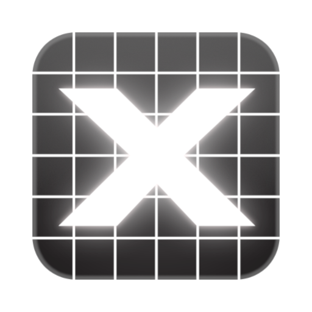

<div align="center">
  <a title="GRX" href="https://grx.electronicloud.app/">
    
  </a>
  <h1>GRX</h1>
  <p>GPU-Accelerated Web Based EDA Manufacturing Artwork Viewer</p>
  <a title="GRX" href="https://grx.electronicloud.app/">
    
  </a>
  
  
  
  <div align="center">
   <h2><a href="https://grx.electronicloud.app/">🔗 grx.electronicloud.app</a></h2>
  </div>
</div>


MENU: **[ABOUT](#about)** | **[KEY FEATURES](#key-features)** | **[GETTING STARTED](#getting-started)** | **[CONTRIBUTE](#contribute)**

---

## ABOUT

GRX is designed to be an easy to use online manufacturing artwork data exchange viewer. Under the hood, GRX uses WebGL for rendering at the best performance and WebWorkers for parsing on multiple cores, even isolating the Main DOM thread from the WebGL renderer thread.

## KEY FEATURES

### Main Features

- 🚀 GPU-Accelerated
- 🏃 Fast and Responsive
- 👍 Easy to use
- 🤏 Touchscreen Friendly
- 🖥 Cross Platform and Available Everywhere

### Supported Artwork Formats

- [x] Gerber RS-274X
  - [x] X1
  - [x] X2
  - [x] X3 ( finally here! )
- [x] NC
  - [x] XNC ( attributes coming soon! )
  - [ ] IPC-NC-349 ( partial support )
  - [x] Excellon
- [x] GDSII
- [ ] ODB++
- [ ] IPC-2581
- [x] DXF
- [ ] OASIS

### Tools

- [WebGL](https://developer.mozilla.org/en-US/docs/Web/API/WebGL_API)
- [Web Workers](https://developer.mozilla.org/en-US/docs/Web/API/Web_Workers_API)
- [regl](http://regl.party/)
- [Typescript](https://www.typescriptlang.org/)
- [Vite](https://vitejs.dev/)
- [React](https://reactjs.org/)
- [Electron](https://electronjs.org/)
- [Tracespace (forked)](https://github.com/hpcreery/tracespace)
- [Mantine](https://mantine.dev/)
- [TurboRepo](https://turbo.build)

## GETTING STARTED

Prerequisites:
- [Node.js](https://nodejs.org/) (version 20 or higher)
- [pnpm](https://pnpm.io/) (version 10 or higher)

Setup the project:

```bash
# Install dependencies
pnpm install

# Prepare the project (build packages, etc.)
pnpm prepare
```

Develop with Web Server:

```bash
# Run the development server
pnpm run dev
```

Develop with Desktop App (Electron):

```bash
# Run the development server
pnpm run dev:desktop
```

Perform Tests:

```bash
# Run tests
pnpm run test
```

Check (Lint/Format) and Typecheck:

```bash
# Run lint and format
pnpm run check
# Run typecheck
pnpm run typecheck
```

Build the Web App:

```bash
# Build the project
pnpm run build
```

Build the Desktop App:

```bash
# Build the desktop app
pnpm run build:desktop
```

Project Structure

```text
├── apps
│   ├── viewer         <-- (main web and desktop app)
│   │   ├── src
│   │   └── package.json
│   ├── docs           <-- (documentation website)
│   │   ├── src
│   │   └── package.json
│   └── homepage       <-- (marketing website)
│       ├── src
│       └── package.json
├── packages
│   ├── engine         <-- (core rendering engine)
│   │   ├── src
│   │   └── package.json
│   └── parser-*       <-- (parser packages for different formats)
│       ├── src
│       └── package.json
├── biome.json
├── pnpm-workspace.yaml
├── turbo.json
└── README.md
```

## CONTRIBUTE

Contributions are very welcome! Please open an issue or submit a pull request if you have any suggestions or improvements or if you just want to say hi! :)  


<a href="https://www.buymeacoffee.com/hpcreery" target="_blank"></a>