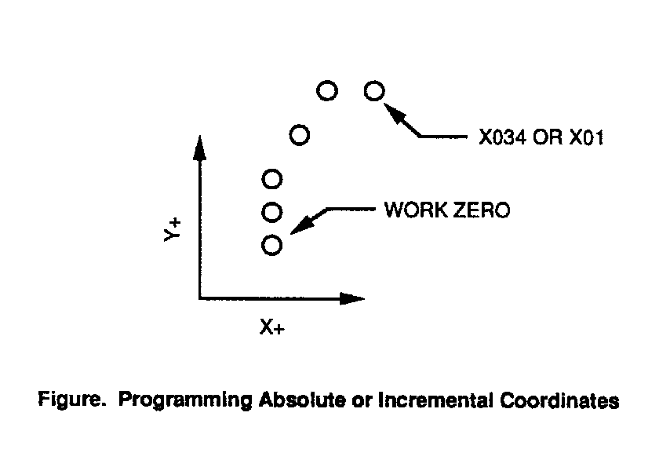
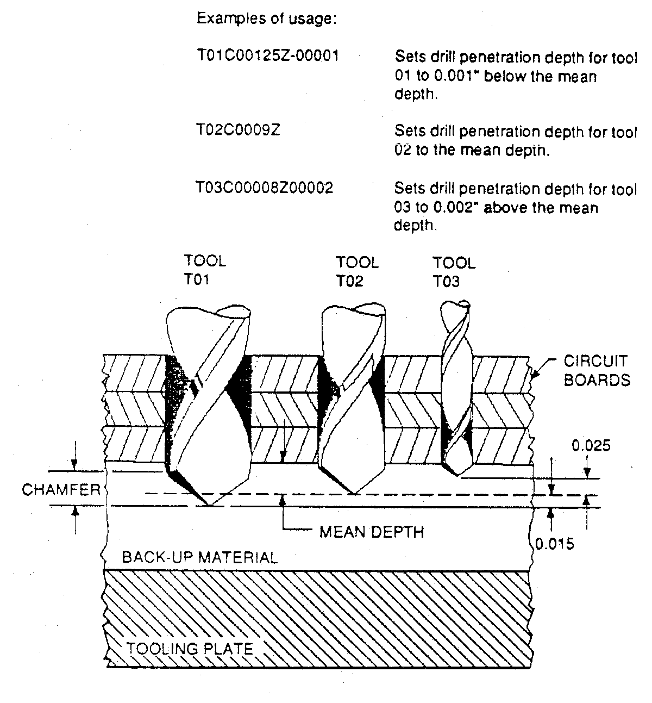
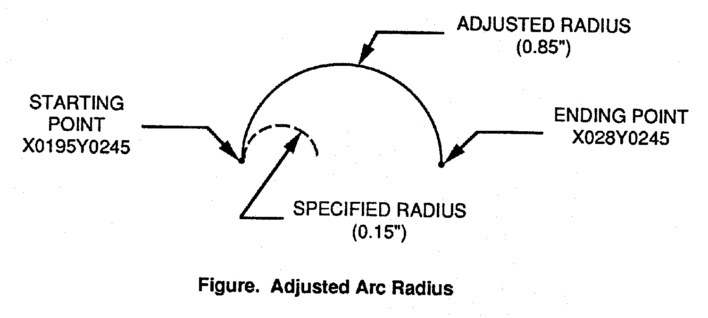

EXCELLON FORMAT SPECIFICATION
=============================

Part Programming Commands
-------------------------

This chapter details the part programming codes used to run your
Excellon machines automatically.

The CNC-7, like all Excellon machines, has a set of part programming
codes that can be used to control the machine for drilling,
toolchanging, setting up machine parameters (such as feeds and speeds),
and routing (if so equipped). Also, like other Excellon machines, the
part program codes are backward compatible. This means that part
programs from a CNC-2,4,5 or 6 can be run on your CNC-7 without
modification. Since newer controls contain new features, the reverse is
not necessarily true (You may not be able to run all CNC-7 programs on a
CNC-2,4,5 or 6). Part programs are simply data files, coming from any
one of a variety of sources or devices. This chapter will detail all
available part program codes available for your use.

------------------------------------------------------------------------

Part Program Headers
--------------------

The M48 header is used to give your machine general information about
the job. This includes the size of tools you want to drill and/or rout
the PC board, the kind of measurement system you are using, the
direction of the X and Y axis of the work, and other details. These
instructions may be generally listed in any order in the header. The
part program header is optional. Most commands that you can program into
the header can also be entered at the CNC-7 console before the program
runs.

Part Program Body
-----------------

The set of drilling and/or routing commands is called the part program
body. It is usually much longer than the header and tells the machine
exactly where each hole is to be drilled, which drill bit to use, what
shape you want routed, etc. The commands are laid out in the sequence
you want them carried out on the PC board. For example, one line of the
program will tell the machine where to drill a hole, the next line will
tell where to drill the next hole, the next line will tell the machine
to stop and change the drill bit. Usually the program is carried out in
sequence from top to bottom. However, some commands will tell the
machine to move to another location on the PC board, go back to a
previous line in the program, and repeat the pattern.

Excellon Program Format vs. Other Manufacturers
-----------------------------------------------

Because Excellon is a pioneer in the manufacture of computerized
drilling and routing equipment, it was necessary for Excellon to develop
a set of commands to control the machines. The set is called Excellon
Numeric Control and it uses the same commands for all Excellon machines.
Some of these commands have become standard in the industry and are
widely used by other manufacturers. The first machines introduced by
Excellon were drilling machines. The set of commands used on drillers
later became known as Format One. When Excellon introduced machines with
routing capability, a set of commands called Format Two was created.
Then in 1979, Excellon revised Format Two to combine drilling and
routing commands into one common set. The machines introduced prior to
1979 are called generation one machines and cannot use Format Two. They
do not have all the capabilities of the newer machines. However, newer
generation two machines can run part programs with either Format One or
Format Two commands.

What a Part Program Must Include
--------------------------------

There is some information that the CNC-7 cannot know without being told.
Some of the things that the part program must tell the machine are:

+--------------------------------------------------------------------------+
| Where to drill each hole                                                 |
+--------------------------------------------------------------------------+
| Where to rout                                                            |
+--------------------------------------------------------------------------+
| What size tool to use                                                    |
+--------------------------------------------------------------------------+

Additionally, if the programmer wants to change the speed of the
direction of a particular tool of the worktable, without stopping the
machine, the change must be made in the part program. Examples of these
changes are:

+--------------------------------------------------------------------------+
| Reverse the direction of routing                                         |
+--------------------------------------------------------------------------+
| Change the table feed rate                                               |
+--------------------------------------------------------------------------+
| Change the spindle RPM                                                   |
+--------------------------------------------------------------------------+

------------------------------------------------------------------------

Writing a Part Program
----------------------

This section describes what you need to know to write a part program
header and a part program. It identifies the mandatory requirements, as
well as the options, and provides you with examples of how a part
program might look.

The Header: Setting Up The Job
------------------------------

The header is always located at the beginning of a part program. It
consists of a series of instructions (commands) that are used to give
your machine general information about the job. This includes the size
and speed of tools, the kind of measurement system you are using, the
direction of the X and Y axis of the work, and other details. The header
can have just a few commands, or dozens of them, depending on your
needs. Most of these commands may be placed in any order. But one thing
the header may NOT include is machine motion commands such as JOG or
HOME. Do you remember that we said the header is optional? This does not
mean that the commands you write into a header are optional. If you
choose not to use a header, then you must either write the commands into
the part program or enter them at the CNC-7 console before the program
runs. Entering them manually can lead to problems. Suppose that you get
an order to produce a set of the same PC boards every two or three
months. Each time the program is loaded into the CNC-7, you must be
given instructions on all the commands that have to be entered before
the job can begin. If you put the commands in the header instead, you
are assured of consistent settings for the machine.

Example of a Header
-------------------

Below is a sample of a header. The PURPOSE shown to the right of the
COMMAND is not part of the command, but is shown for your benefit to
explain the command:

+--------------------------------------+--------------------------------------+
| COMMAND                              | **PURPOSE**                          |
+--------------------------------------+--------------------------------------+
| M48                                  | The beginning of a header            |
+--------------------------------------+--------------------------------------+
| INCH,LZ                              | Use the inch measuring system with   |
|                                      | leading zeros                        |
+--------------------------------------+--------------------------------------+
| VER,1                                | Use Version 1 X and Y axis layout    |
+--------------------------------------+--------------------------------------+
| FMAT,2                               | Use Format 2 commands                |
+--------------------------------------+--------------------------------------+
| 1/2/3                                | Link tools 1, 2, and 3               |
+--------------------------------------+--------------------------------------+
| T1C.04F200S65                        | Set Tool 1 for 0.040" with infeed    |
|                                      | rate of 200 inch/min Speed of 65,000 |
|                                      | RPM                                  |
+--------------------------------------+--------------------------------------+
| DETECT,ON                            | Detect broken tools                  |
+--------------------------------------+--------------------------------------+
| M95                                  | End of the header                    |
+--------------------------------------+--------------------------------------+

------------------------------------------------------------------------

Beginning of a Part Program Header
----------------------------------

M48
---

M48 Defines the start of an M48 part program header. This command must
appear on the first line of the part program header. This tells the
CNC-7 that the program has a header. Please note that comment lines and
blank lines are permitted in the M48 header and are ignored. Comment
lines are lines of text beginning with the semicolon (;) character.

See also: Part Program Headers

------------------------------------------------------------------------

End of a Part Program Header
----------------------------

M95
---

M95 Defines the end of a part program header. Either this command or the
% command must follow the last header command in the part program
header. This tells the CNC-7 where the header ends. When this command is
used, the machine will immediately start to execute the part program
body commands following the M95 command.

See also: Part Program Headers, M48

------------------------------------------------------------------------

Rewind Stop
-----------

%
-

% Defines the end of a part program header. Either this command or the
M95 command must follow the last header command in the part program
header. This tells the CNC-7 where the header ends. When this command is
used, the machine will stop at the end of the header and await your
action. You may enter any appropriate Keyboard commands and/or press
CYCLE START to continue.

**Note**: This command has a different meaning when used in the part
program body.

See also: Part Program Headers, M48, M49

------------------------------------------------------------------------

Commands Used in a Header
-------------------------

The following table provides you with a list of commands which (not a
complete list) are the most used in a part program header. Some
Operating System commands, which are discussed in the chapter on System
Software, are not included here. If other commands are used, the CNC-7
will display a message when you try to run the part program. Most of the
commands between the M48 and M95 or % commands may be arranged in any
order, but there are some common sense exceptions. For example, the
INCH/METRIC command must be specified before any commands with
dimensions.

+--------------------------------------+--------------------------------------+
| COMMAND                              | **DESCRIPTION**                      |
+--------------------------------------+--------------------------------------+
| AFS                                  | Automatic Feeds and Speeds           |
+--------------------------------------+--------------------------------------+
| ATC                                  | Automatic Tool Change                |
+--------------------------------------+--------------------------------------+
| BLKD                                 | Delete all Blocks starting with a    |
|                                      | slash (/)                            |
+--------------------------------------+--------------------------------------+
| CCW                                  | Clockwise or Counterclockwise        |
|                                      | Routing                              |
+--------------------------------------+--------------------------------------+
| CP                                   | Cutter Compensation                  |
+--------------------------------------+--------------------------------------+
| DETECT                               | Broken Tool Detection                |
+--------------------------------------+--------------------------------------+
| DN                                   | Down Limit Set                       |
+--------------------------------------+--------------------------------------+
| DTMDIST                              | Maximum Rout Distance Before         |
|                                      | Toolchange                           |
+--------------------------------------+--------------------------------------+
| EXDA                                 | Extended Drill Area                  |
+--------------------------------------+--------------------------------------+
| FMAT                                 | Format 1 or 2                        |
+--------------------------------------+--------------------------------------+
| FSB                                  | Turns the Feed/Speed Buttons off     |
+--------------------------------------+--------------------------------------+
| HPCK                                 | Home Pulse Check                     |
+--------------------------------------+--------------------------------------+
| ICI                                  | Incremental Input of Part Program    |
|                                      | Coordinates                          |
+--------------------------------------+--------------------------------------+
| INCH                                 | Measure Everything in Inches         |
+--------------------------------------+--------------------------------------+
| METRIC                               | Measure Everything in Metric         |
+--------------------------------------+--------------------------------------+
| M48                                  | Beginning of Part Program Header     |
+--------------------------------------+--------------------------------------+
| M95                                  | End of Header                        |
+--------------------------------------+--------------------------------------+
| NCSL                                 | NC Slope Enable/Disable              |
+--------------------------------------+--------------------------------------+
| OM48                                 | Override Part Program Header         |
+--------------------------------------+--------------------------------------+
| OSTOP                                | Optional Stop Switch                 |
+--------------------------------------+--------------------------------------+
| OTCLMP                               | Override Table Clamp                 |
+--------------------------------------+--------------------------------------+
| PCKPARAM                             | Set up pecking tool,depth,infeed and |
|                                      | retract parameters                   |
+--------------------------------------+--------------------------------------+
| PF                                   | Floating Pressure Foot Switch        |
+--------------------------------------+--------------------------------------+
| PPR                                  | Programmable Plunge Rate Enable      |
+--------------------------------------+--------------------------------------+
| PVS                                  | Pre-vacuum Shut-off Switch           |
+--------------------------------------+--------------------------------------+
| R,C                                  | Reset Clocks                         |
+--------------------------------------+--------------------------------------+
| R,CP                                 | Reset Program Clocks                 |
+--------------------------------------+--------------------------------------+
| R,CR                                 | Reset Run Clocks                     |
+--------------------------------------+--------------------------------------+
| R,D                                  | Reset All Cutter Distances           |
+--------------------------------------+--------------------------------------+
| R,H                                  | Reset All Hit Counters               |
+--------------------------------------+--------------------------------------+
| R,T                                  | Reset Tool Data                      |
+--------------------------------------+--------------------------------------+
| SBK                                  | Single Block Mode Switch             |
+--------------------------------------+--------------------------------------+
| SG                                   | Spindle Group Mode                   |
+--------------------------------------+--------------------------------------+
| SIXM                                 | Input From External Source           |
+--------------------------------------+--------------------------------------+
| T                                    | Tool Information                     |
+--------------------------------------+--------------------------------------+
| TCST                                 | Tool Change Stop                     |
+--------------------------------------+--------------------------------------+
| UP                                   | Upper Limit Set                      |
+--------------------------------------+--------------------------------------+
| VER                                  | Selection of X and Y Axis Version    |
+--------------------------------------+--------------------------------------+
| Z                                    | Zero Set                             |
+--------------------------------------+--------------------------------------+
| ZA                                   | Auxiliary Zero                       |
+--------------------------------------+--------------------------------------+
| ZC                                   | Zero Correction                      |
+--------------------------------------+--------------------------------------+
| ZS                                   | Zero Preset                          |
+--------------------------------------+--------------------------------------+
| Z+\# or Z-\#                         | Set Depth Offset                     |
+--------------------------------------+--------------------------------------+
| %                                    | Rewind Stop                          |
+--------------------------------------+--------------------------------------+
| \#/\#/\#                             | Link Tool for Automatic Tool Change  |
+--------------------------------------+--------------------------------------+
| /                                    | Clear Tool Linking                   |
+--------------------------------------+--------------------------------------+

------------------------------------------------------------------------

Duplicate Commands
------------------

If you have a command in the header and the exact same command in the
part program body, there is no harm done. Nor will it matter if you
enter the exact same command from the keyboard. In each case, because
the commands do not contradict each other, the performance of the
machine will not be affected.

------------------------------------------------------------------------

Keyboard and Header Commands vs. Body Commands
----------------------------------------------

Some commands allow you to specify optional information. When the
options in the part program body are different from the options in the
header or console, the body options are not used. Suppose you specify in
the header which spindle speed you want for a particular tool. Then you
repeat the tool command in the part program body and specify a different
speed. The speed in the header will override the speed in the body. You
could change the speed ten times in the program, but the spindle will
rotate at the speed you specified in the header, each and every time.

Keyboard vs. Header Commands
----------------------------

Commands entered by you at the keyboard will also override duplicate
commands in the part program body. Keyboard entered commands and header
commands have the same authority, and they can conflict with each other.
But system software uses the latest one entered as the governing
authority. After a part program has been loaded, any commands entered at
the keyboard will override the same command in the header. But if the
command is entered at the keyboard, and then the part program is loaded,
the header overrides the keyboard.

Beyond The Header: The Part Program Body
----------------------------------------

+--------------------------------------+--------------------------------------+
| COMMAND                              | **DESCRIPTION**                      |
+--------------------------------------+--------------------------------------+
| A\#                                  | Arc Radius                           |
+--------------------------------------+--------------------------------------+
| B\#                                  | Retract Rate                         |
+--------------------------------------+--------------------------------------+
| C\#                                  | Tool Diameter                        |
+--------------------------------------+--------------------------------------+
| F\#                                  | Table Feed Rate;Z Axis Infeed Rate   |
+--------------------------------------+--------------------------------------+
| G00X\#Y\#                            | Route Mode                           |
+--------------------------------------+--------------------------------------+
| G01                                  | Linear (Straight Line) Mode          |
+--------------------------------------+--------------------------------------+
| G02                                  | Circular CW Mode                     |
+--------------------------------------+--------------------------------------+
| G03                                  | Circular CCW Mode                    |
+--------------------------------------+--------------------------------------+
| G04                                  | X\# Variable Dwell                   |
+--------------------------------------+--------------------------------------+
| G05                                  | Drill Mode                           |
+--------------------------------------+--------------------------------------+
| G07                                  | Override current tool feed or speed  |
+--------------------------------------+--------------------------------------+
| G32X\#Y\#A\#                         | Routed Circle Canned Cycle           |
+--------------------------------------+--------------------------------------+
| CW G33X\#Y\#A\#                      | Routed Circle Canned Cycle           |
+--------------------------------------+--------------------------------------+
| CCW G34,\#(,\#)                      | Select Vision Tool                   |
+--------------------------------------+--------------------------------------+
| G35(X\#Y\#)                          | Single Point Vision Offset (Relative |
|                                      | to Work Zero)                        |
+--------------------------------------+--------------------------------------+
| G36(X\#Y\#)                          | Multipoint Vision Translation        |
|                                      | (Relative to Work Zero)              |
+--------------------------------------+--------------------------------------+
| G37                                  | Cancel Vision Translation or Offset  |
|                                      | (From G35 or G36)                    |
+--------------------------------------+--------------------------------------+
| G38(X\#Y\#)                          | Vision Corrected Single Hole         |
|                                      | Drilling (Relative to Work Zero)     |
+--------------------------------------+--------------------------------------+
| G39(X\#Y\#)                          | Vision System Autocalibration        |
+--------------------------------------+--------------------------------------+
| G40                                  | Cutter Compensation Off              |
+--------------------------------------+--------------------------------------+
| G41                                  | Cutter Compensation Left             |
+--------------------------------------+--------------------------------------+
| G42                                  | Cutter Compensation Right            |
+--------------------------------------+--------------------------------------+
| G45(X\#Y\#)                          | Single Point Vision Offset (Relative |
|                                      | to G35 or G36)                       |
+--------------------------------------+--------------------------------------+
| G46(X\#Y\#)                          | Multipoint Vision Translation        |
|                                      | (Relative to G35 or G36)             |
+--------------------------------------+--------------------------------------+
| G47                                  | Cancel Vision Translation or Offset  |
|                                      | (From G45 or G46)                    |
+--------------------------------------+--------------------------------------+
| G48(X\#Y\#)                          | Vision Corrected Single Hole         |
|                                      | Drilling (Relative to G35 or G36)    |
+--------------------------------------+--------------------------------------+
| G82(G81)                             | Dual In Line Package                 |
+--------------------------------------+--------------------------------------+
| G83                                  | Eight Pin L Pack                     |
+--------------------------------------+--------------------------------------+
| G84                                  | Circle                               |
+--------------------------------------+--------------------------------------+
| G85                                  | Slot                                 |
+--------------------------------------+--------------------------------------+
| G87                                  | Routed Step Slot Canned Cycle        |
+--------------------------------------+--------------------------------------+
| G90                                  | Absolute Mode                        |
+--------------------------------------+--------------------------------------+
| G91                                  | Incremental Input Mode               |
+--------------------------------------+--------------------------------------+
| G93X\#Y\#                            | Zero Set                             |
+--------------------------------------+--------------------------------------+
| H\#                                  | Maximum hit count                    |
+--------------------------------------+--------------------------------------+
| I\#J\#                               | Arc Center Offset                    |
+--------------------------------------+--------------------------------------+
| M00(X\#Y\#)                          | End of Program - No Rewind           |
+--------------------------------------+--------------------------------------+
| M01                                  | End of Pattern                       |
+--------------------------------------+--------------------------------------+
| M02X\#Y\#                            | Repeat Pattern Offset                |
+--------------------------------------+--------------------------------------+
| M06(X\#Y\#)                          | Optional Stop                        |
+--------------------------------------+--------------------------------------+
| M08                                  | End of Step and Repeat               |
+--------------------------------------+--------------------------------------+
| M09(X\#Y\#)                          | Stop for Inspection                  |
+--------------------------------------+--------------------------------------+
| M14                                  | Z Axis Route Position With Depth     |
|                                      | Controlled Contouring                |
+--------------------------------------+--------------------------------------+
| M15                                  | Z Axis Route Position                |
+--------------------------------------+--------------------------------------+
| M16                                  | Retract With Clamping                |
+--------------------------------------+--------------------------------------+
| M17                                  | Retract Without Clamping             |
+--------------------------------------+--------------------------------------+
| M18                                  | Command tool tip check               |
+--------------------------------------+--------------------------------------+
| M25                                  | Beginning of Pattern                 |
+--------------------------------------+--------------------------------------+
| M30(X\#Y\#)                          | End of Program Rewind                |
+--------------------------------------+--------------------------------------+
| M45,long message\\                   | Long Operator message on multiple\\  |
|                                      | part program lines                   |
+--------------------------------------+--------------------------------------+
| M47,text                             | Operator Message                     |
+--------------------------------------+--------------------------------------+
| M50,\#                               | Vision Step and Repeat Pattern Start |
+--------------------------------------+--------------------------------------+
| M51,\#                               | Vision Step and Repeat Rewind        |
+--------------------------------------+--------------------------------------+
| M52(\#)                              | Vision Step and Repeat Offset        |
|                                      | Counter Control                      |
+--------------------------------------+--------------------------------------+
| M02XYM70                             | Swap Axes                            |
+--------------------------------------+--------------------------------------+
| M60                                  | Reference Scaling enable             |
+--------------------------------------+--------------------------------------+
| M61                                  | Reference Scaling disable            |
+--------------------------------------+--------------------------------------+
| M62                                  | Turn on peck drilling                |
+--------------------------------------+--------------------------------------+
| M63                                  | Turn off peck drilling               |
+--------------------------------------+--------------------------------------+
| M71                                  | Metric Measuring Mode                |
+--------------------------------------+--------------------------------------+
| M72                                  | Inch Measuring Mode                  |
+--------------------------------------+--------------------------------------+
| M02XYM80                             | Mirror Image X Axis                  |
+--------------------------------------+--------------------------------------+
| M02XYM90                             | Mirror Image Y Axis                  |
+--------------------------------------+--------------------------------------+
| M97,text                             | Canned Text                          |
+--------------------------------------+--------------------------------------+
| M98,text                             | Canned Text                          |
+--------------------------------------+--------------------------------------+
| M99,subprogram                       | User Defined Stored Pattern          |
+--------------------------------------+--------------------------------------+
| P\#X\#(Y\#)                          | Repeat Stored Pattern                |
+--------------------------------------+--------------------------------------+
| R\#M02X\#Y\#                         | Repeat Pattern (S&R)                 |
+--------------------------------------+--------------------------------------+
| R\#(X\#Y\#)                          | Repeat Hole                          |
+--------------------------------------+--------------------------------------+
| S\#                                  | Spindle RPM                          |
+--------------------------------------+--------------------------------------+
| T\#                                  | Tool Selection; Cutter Index         |
+--------------------------------------+--------------------------------------+
| Z+\# or Z-\#                         | Depth Offset                         |
+--------------------------------------+--------------------------------------+
| %                                    | Beginning of Pattern (see M25        |
|                                      | command)                             |
+--------------------------------------+--------------------------------------+
| /                                    | Block Delete                         |
+--------------------------------------+--------------------------------------+

List of Equivalent Format One Commands
======================================

+--------------------------------------+--------------------------------------+
| FORMAT TWO COMMAND                   | **EQUIVALENT FORMAT ONE COMMAND**    |
+--------------------------------------+--------------------------------------+
| G05                                  | G81                                  |
+--------------------------------------+--------------------------------------+
| M00                                  | M02                                  |
+--------------------------------------+--------------------------------------+
| M01                                  | M24                                  |
+--------------------------------------+--------------------------------------+
| M02                                  | M26                                  |
+--------------------------------------+--------------------------------------+
| M06                                  | M01                                  |
+--------------------------------------+--------------------------------------+
| M08                                  | M27                                  |
+--------------------------------------+--------------------------------------+
| M09                                  | M00                                  |
+--------------------------------------+--------------------------------------+
| M02X\#Y\#M70                         | M26X\#Y\#M23                         |
+--------------------------------------+--------------------------------------+
| M72                                  | M70                                  |
+--------------------------------------+--------------------------------------+
| M02X\#Y\#M80                         | M26X\#Y\#M21                         |
+--------------------------------------+--------------------------------------+
| M02X\#Y\#M90                         | M26X\#Y\#M22                         |
+--------------------------------------+--------------------------------------+
| R\#M02                               | R\#M26                               |
+--------------------------------------+--------------------------------------+

------------------------------------------------------------------------

X and Y Coordinates
-------------------

The location on the PC board where a hole is to be drilled or a router
begins or ends a move is called a coordinate. A coordinate is a pair of
measurements used to locate that point. It is measured along an axis
which runs from the front to the back of the machine, and an axis which
runs from left to right. These axes are perpendicular to each other and
are known as the X and Y axis. When the machine is not in the routing
mode, the coordinate is also the command for a drill bit to plunge into
the panel and drill a hole. The coordinate tells the CNC-7 to move the
spindle to the location and drill. There are two ways to move from
coordinate to coordinate and you must choose one of them when you are
programming. The two ways are absolute and incremental. Absolute means
that every coordinate is measured to the same location on the board.
This location is called work zero. Incremental means that every
coordinate is measured to the previous coordinate. Unless you specify
otherwise, the CNC-7 runs in the absolute mode, and part programs must
be programmed for absolute. When you program in the incremental mode,
include the ICI,ON command in the part program header, or in the
MACH.DAT file. The following illustrates how a set of holes are
programmed in either absolute or incremental mode. Note that when either
the X or Y coordinate does not change from one hole to another, it does
not have to be repeated.

+--------------------------------------+--------------------------------------+
| ABSOLUTE                             | **INCREMENTAL**                      |
+--------------------------------------+--------------------------------------+
| XY                                   | XY                                   |
+--------------------------------------+--------------------------------------+
| Y01                                  | Y01                                  |
+--------------------------------------+--------------------------------------+
| Y02                                  | Y01                                  |
+--------------------------------------+--------------------------------------+
| X012Y032                             | X012Y012                             |
+--------------------------------------+--------------------------------------+
| X024Y044                             | X012Y012                             |
+--------------------------------------+--------------------------------------+
| X034                                 | X01                                  |
+--------------------------------------+--------------------------------------+



------------------------------------------------------------------------

Inch vs. Metric
---------------

Coordinates are measured either in inch or metric (millimeters). Inch
coordinates are in six digits (00.0000) with increments as small as
0.0001 (1/10,000). Metric coordinates can be measured in microns
(thousandths of a millimeter) in one of the following three ways:

+--------------------------------------------------------------------------+
| Five digit 10 micron resolution (000.00)                                 |
+--------------------------------------------------------------------------+
| Six digit 10 micron resolution (0000.00)                                 |
+--------------------------------------------------------------------------+
| Six digit micron resolution (000.000)                                    |
+--------------------------------------------------------------------------+

You specify the coordinate measurement you want by using the METRIC or
INCH command in the program header. When the program is running on the
machine, all X and Y coordinates will be displayed on the screen in the
form you have chosen. Additionally, all other measurements will be
displayed in this form, including the following:

+--------------------------------------------------------------------------+
| Feed Rate                                                                |
+--------------------------------------------------------------------------+
| Tool Diameter                                                            |
+--------------------------------------------------------------------------+
| Spindle Upper and Lower Limit                                            |
+--------------------------------------------------------------------------+
| Rout Depth                                                               |
+--------------------------------------------------------------------------+
| Spindle Retract Rate                                                     |
+--------------------------------------------------------------------------+
| All Zero Locations                                                       |
+--------------------------------------------------------------------------+
| Depth Offset                                                             |
+--------------------------------------------------------------------------+
| Routing Distance                                                         |
+--------------------------------------------------------------------------+

------------------------------------------------------------------------

Leading and Trailing Zeros
--------------------------

When you type coordinates into the CNC-7, it is important that you
understand leading and trailing zeros. The previous section explains
that the CNC-7 uses inches in six digits and metric in five or six
digits. The zeros to the left of the coordinate are called leading zeros
(LZ). The zeros to right of the coordinate are called trailing zeros
(TZ). The CNC-7 uses leading zeros unless you specify otherwise through
a part program or the console. You can do so with the INCH/METRIC
command discussed later in this chapter. If you don't specify leading or
trailing zeros, the CNC-7 will automatically use the last setting. With
leading zeros, when you type in a coordinate, the leading zeros must
always be included. If you don't, the CNC-7 will misinterpret the
coordinate and move to the wrong location on PC board. Trailing zeros
are unneeded and may be left off. The CNC-7 will automatically add them.
This allows you to save time in typing the coordinates. If you have
selected trailing zeros, the reverse of the above is true. You must show
all zeros to the right of the number and can omit all zeros to the left
of the number. The CNC-7 will count the number of digits you typed and
automatically fill in the missing zeros.

Here are some examples of using the leading zero inch mode:

+--------------------------------------+--------------------------------------+
| X0075                                | Correct                              |
+--------------------------------------+--------------------------------------+
| X007500                              | Incorrect, the two trailing zeros    |
|                                      | are unnecessary                      |
+--------------------------------------+--------------------------------------+
| Y014                                 | Correct                              |
+--------------------------------------+--------------------------------------+
| Y014000                              | Incorrect, the three trailing zeros  |
|                                      | are unnecessary                      |
+--------------------------------------+--------------------------------------+

Here are some examples of using the trailing zero inch mode:

+--------------------------------------------------------------------------+
| X7500 = 0.75 inch                                                        |
+--------------------------------------------------------------------------+
| X75 = 0.0075 inch                                                        |
+--------------------------------------------------------------------------+

The rules for typing leading and trailing zeros for other commands are
discussed under each command.

------------------------------------------------------------------------

Decimal Places
--------------

Decimals are not needed in either INCH or METRIC modes. But if you do
use them, the decimal point will automatically override leading zero or
trailing zero mode. Coordinates can be typed with or without the
decimal. If you use the decimal and the coordinate distance is less than
one inch or one centimeter, you can eliminate the zeros to the left of
the decimal. For example, in the INCH format:

+--------------------------------------+--------------------------------------+
| X.075                                | Correct                              |
+--------------------------------------+--------------------------------------+
| X00.075                              | Incorrect, the two zeros are         |
|                                      | unnecessary                          |
+--------------------------------------+--------------------------------------+

The same applies to the METRIC format with three and four zeros to the
left of the decimal. But in either case, if you have a whole number to
the left of the decimal, it must be included. For example:

+--------------------------------------+--------------------------------------+
| Y1.45                                | Correct                              |
+--------------------------------------+--------------------------------------+
| Y0001.45                             | Incorrect, the three zeros are       |
|                                      | unnecessary                          |
+--------------------------------------+--------------------------------------+

If you choose to type coordinates without the decimal, all zeros to the
left of the decimal must be shown. For example:

+--------------------------------------------------------------------------+
| X00093 = 0.093 inch in inch format                                       |
+--------------------------------------------------------------------------+
| Y00093 = 93 micron in metric format 000.00                               |
+--------------------------------------------------------------------------+

------------------------------------------------------------------------

Tool Commands
-------------

There are several commands used to select and control tools. Some are
used separately and others are combined to form a single command.
Whenever tool commands are used in the header, they are strictly for
loading tool data into the CNC-7. When tool commands are intended for
tool changing or for machine movements, they must be in the body of the
program. The \# in each command indicates that a number is to be used to
designate quantity, distance, speed, etc. From one to six digits are
used, depending on the command. The number of the tool specified with
the tool command is the same as the tool number on the Tool Data Page.

------------------------------------------------------------------------

Tool Commands
-------------

Tool Selection
--------------

T\#
---

T\# is used to specify which tool is to be used next in the manual or
automatic tool change mode. It may be used in the part program header or
body, or an M02 block step and repeat patterns. On machines with
automatic tool change, the spindle will put away the tool it is using,
pick up the tool number you specify in the place of \#, and move to the
next coordinate in the part program. On machines with manual tool
change, the worktable will move to the part position and stop. The
screen will display the message in the Machine Status box. After
changing the tool, you press the CYCLE START button and the machine
resumes operation. Tool numbers 1 through 9 may be specified with or
without a leading zero. (e.g. 01 or 1)

Examples of usage:

+--------------------------------------+--------------------------------------+
| T1                                   | Tool number one                      |
+--------------------------------------+--------------------------------------+
| T01                                  | Tool number one                      |
+--------------------------------------+--------------------------------------+
| T10                                  | Tool number ten                      |
+--------------------------------------+--------------------------------------+

------------------------------------------------------------------------

Tool Selection with Compensation Index
--------------------------------------

T\#(\#) is used to select a specific tool and to set the Compensation
Index for that tool. This command allows you to specify four digits. The
last two are for the index number. If you omit the last two digits, or
specify zeros, the index will be set equal to the tool number in the
first two digits.

Compensation value is used in routing operations. Routing tools can
bend and deflect away from the work, especially when moved in the
counterclockwise direction. The Compensation value offsets the path of
the tool to compensate for the size and deflection of the tool. For
example, a tool of 0.092" diameter might be specified for a clockwise
direction. In the counterclockwise direction, however, you might need to
use a diameter of 0.094". But you may not have such a diameter, or it
may not be possible or practical to switch tools. Instead, you can
assign an index number for a tool with a diameter of 0.094" (Refer to
the CP,\#,\#.\# command in the Keyboard Commands chapter). When you
identify the index number with your 0.092" diameter routing tool, the
CNC-7 will offset the path of the tool as though it were 0.094"
diameter.

The Compensation Index value must be entered before the rout mode is
turned on (G00 command), and may not be changed during routing moves.

Example of usage:

+--------------------------------------+--------------------------------------+
| T0302                                | Tool number 3 with Compensation      |
|                                      | Index 2                              |
+--------------------------------------+--------------------------------------+

See also: CP,\#,\#.\#

------------------------------------------------------------------------

Z-Axis Infeed
-------------

F\#
---

F\# is used within a routing sequence to set the worktable feed rate, or
in a drilling sequence to set the spindle (Z-axis) infeed rate. Feed
rate values are always entered in leading zero format, e.g.: F2 means
200 inches per minute, and F02 means 20 inches per minute. The value you
assign in place of \#, indicates inches per minute (IPM) or millimeters
per second (mm/s). Decimals are not to be used with this command. They
will produce a message when the part program runs on the machine.
Drilling feed rates must be given to the CNC-7 or the machine will not
run. The rate may be specified in the Tool Data Page, or through the F\#
command. The F\# command may also be entered at the Tool Data Page to
change the infeed rate for a particular tool.

The drilling feed rate can be set from 10 to 500 IPM (4 to 212 mm/s),
in increments of 1 IPM (1mm/s). The routing table feed rate can be set
from 10 to 150 IPM (4 to 63 mm/s), in increments of 1 IPM (1 mm/s). If
you do not set a feed rate, the CNC-7 will use a maximum rate of 100 IPM
for any router.

Examples of usage:

+--------------------------------------+--------------------------------------+
| T01F2                                | Tool number one with a spindle       |
|                                      | infeed rate of 200 IPM or 200 mm/s   |
+--------------------------------------+--------------------------------------+
| F07                                  | Worktable feed rate of 70 IPM or 70  |
|                                      | mm/s for routing                     |
+--------------------------------------+--------------------------------------+
| F03                                  | Worktable feed rate of 30 IPM or 30  |
|                                      | mm/s for routing                     |
+--------------------------------------+--------------------------------------+

------------------------------------------------------------------------

Retract Rate
------------

B\#
---

B\# is used to set the spindle (Z-axis) retract rate, e.g., the speed at
which the tool is withdrawn from the work. Retract values are always
entered in leading zero format, e.g.: B02 means 200 inches per minute,
and B002 means 20 inches per minute. The value you assign in place of \#
indicates inches per minute (in/min) of millimeters per second (mm/s).
Decimals are not to be used with this command. They will produce a
message when the part program runs on the machine. The B\# command may
also be entered at the Tool Data Page to change the retract rate for a
particular tool. A default retract rate is established when the CNC-7 is
started. If NO B\# command is specified for a tool, the default retract
rate will be used. The default rate may be changed using the RTR
keyboard command. The retract rate can be set from 10 to 1000 IPM (5 to
425 mm/s), in increments of 1 IPM (1 mm/s). Unless altered by the RTR
command, the default retract rate is 1000 in/min (425 mm/s).

Example of usage:

+--------------------------------------+--------------------------------------+
| T01B02                               | Tool number one with a spindle       |
|                                      | retract rate of 200 IPM or 200 mm/s. |
+--------------------------------------+--------------------------------------+

See also: RTR

------------------------------------------------------------------------

Spindle RPM

S\#
---

S\# Sets the speed of spindle rotation. The value you assign in place of
\# indicates RPM in thousands. Trailing zeros are not shown. The S\#
command may also be entered at the Tool Data Page to change the rate for
a particular tool. The spindle speed on most machines may be programmed
from a minimum of 14,000 RPM to a maximum of 60,000 RPM for routers and
80,000 RPM for drilling tools. Some machines have spindles speeds
greater than 100,000 RPM. When you specify a speed of six digits on
these machines, use a decimal point, followed by a number to indicate
hundreds of RPM's. This command may not be used by itself, but must be
included in a tool selection block (T\#S\#).

Examples of usage:

+--------------------------------------+--------------------------------------+
| T01S612                              | Tool number one with a speed of      |
|                                      | 61,200 RPM                           |
+--------------------------------------+--------------------------------------+
| T06F200S61                           | Tool number six with a feed rate of  |
|                                      | 200 IPM or 20 mm/s and a speed of    |
|                                      | 61,000 RPM                           |
+--------------------------------------+--------------------------------------+
| T03S6                                | Tool number three with a speed of    |
|                                      | 60,000 RPM                           |
+--------------------------------------+--------------------------------------+
| T04S110.5                            | Tool number four with a speed of     |
|                                      | 110,500 RPM                          |
+--------------------------------------+--------------------------------------+

------------------------------------------------------------------------

Override Current Tool Feed OR Speed
-----------------------------------

G07
---

When G07 is used inside the part program, the tool feed or speed can be
changed after G07 command. It only affects the current part program.

------------------------------------------------------------------------

Tool Diameter
-------------

C\#
---

C\# is used to select the tool diameter necessary for certain machine
canned cycles. When feed and speeds are not specified with Tool
Diameter, the CNC-7 will load them from the tool diameter table if a
tool diameter table has been loaded. The value you specify in place of
\# indicates the diameter in thousandths of an inch, or microns,
depending on which measurement mode the machine is set for. Trailing
zeros are not shown. The C\# command may also be entered at the Tool
Data Page to change the diameter of a particular tool. This command
should not be used by itself but must be included in a tool selection
command block (T\#C\#).

Examples of usage:

+--------------------------------------+--------------------------------------+
| T1C.04                               | Set Tool number one to .040"         |
|                                      | diameter (with feed and speed from   |
|                                      | the tool diameter page).             |
+--------------------------------------+--------------------------------------+
| T1C.04F200S65                        | Set Tool number one to .040"         |
|                                      | diameter with an infeed rate of 200  |
|                                      | and spindle speed of 65,000 RPM.     |
+--------------------------------------+--------------------------------------+

See also: Canned Cycle Commands

------------------------------------------------------------------------

Set Maximum Hit Count
---------------------

H\#
---

H\# is used to make sure that only sharp drill bits are used to drill
holes. You set the maximum number of times that a drill tool may drill a
hole (hit) by specifying a number in place of \#. Hit counters keep
track of the number of times each tool bit drills a hole. When the
counter equals the maximum set by this command, the tool bit is
considered to be expired, and the machine stops drilling. If other tools
are linked to the expired tool, the machine will automatically change
tools and continue drilling. Otherwise, the worktable will move to the
park position and stop. The H\# command may also be entered at the Tool
Data Page to change the maximum number of hits for a particular tool.
This command should not be used by itself, but must be included in a
tool selection command block (T\#H\#). Leading and trailing zeros do not
apply and decimals are not allowed. This command can also be used to
turn off a hit counter so that the drill bit continues drilling. Type
the H by itself without a number and the hit counter for that tool will
be turned off.

Examples of usage:

+--------------------------------------+--------------------------------------+
| T03H2000                             | Tool number three set at 2,000 hits  |
|                                      | maximum                              |
+--------------------------------------+--------------------------------------+
| T01H                                 | Tool number one maximum hit counter  |
|                                      | is turned off                        |
+--------------------------------------+--------------------------------------+

------------------------------------------------------------------------

-

Depth Offset
------------

Z+\# or Z-\#
------------

Z+\# (or Z-\#) Sets the Depth Offset for tools. This command is used in
conjunction with T\# command. Depth Offset may be programmed for each
logical tool. A mean depth, common to all tools, can be supplied through
the part program header, or by you through the keyboard, or through the
LOWER LIMIT or ROUT DEPTH switches on the Touch Screen. The Depth Offset
is programmed as a deviation or offset from the mean depth. You supply
the offset in place of \#.

The offset value will be in inch or metric, LZ or TZ, depending on how
the machine is set. The offset can be supplied in increments of 0.001"
(0.01mm). Decimal mode may be used. Plus signs (+) may be omitted, but
minus signs (-) must be used to indicate negative values. A positive
value offsets the depth of the tool above the mean depth set by you or
the part program header. A negative value represents a distance below
the mean depth. Depth Offset permits control of drill penetration depth
into the backup material. A large tool Depth Offset, requires a greater
penetration depth than does an intermediate size tool, or a small tool.
Accurate penetration depth is necessary to ensure that the tool chamfer
clears the back of the last circuit board in the stack being drilled.
The mean depth, plus the programmed Depth Offset, gives you the actual
depth for that tool. The resulting actual depth must not be less than
zero because this represents the lower limit of Z-axis (spindle) travel.
A minimum Z-axis stroke length must be maintained. Therefore, the actual
depth must be at least 0.125" (3.18mm) lower than the Upper Limit set.

The Z\# command may also be entered at the Tool Data Page to change the
depth offset for a particular tool. Depth Offsets may be included with
preprogrammed infeed and speed information through the keyboard or a
part program header. Offsets can also be stored on the Diameter Page.
The Depth Offset may also be included in a part program as part of an
integral feed and speed block.

Examples of usage:

+--------------------------------------+--------------------------------------+
| T01C00125Z-00001                     | Sets drill penetration depth for     |
|                                      | tool 01 to 0.001" below the mean     |
|                                      | depth                                |
+--------------------------------------+--------------------------------------+
| T02C0009Z                            | Sets drill penetration depth for     |
|                                      | tool 02 to the mean depth            |
+--------------------------------------+--------------------------------------+
| T03C00008Z00002                      | Sets drill penetration depth for     |
|                                      | tool 03 to 0.002" above the mean     |
|                                      | depth                                |
+--------------------------------------+--------------------------------------+



------------------------------------------------------------------------

Link Tools for Automatic Tool Changers
--------------------------------------

\#/\#/\#
--------

\#/\#/\# links tools together so that when one tool expires (too dull to
drill anymore), the machine will automatically change tools and continue
drilling. Naturally, all the tools linked together must be the same
size. You select the tools to be linked by specifying a tool number in
place of \#. You may link as many of the same size tools together as you
need. When the CNC-7 reads this command in your part program, it will
update the Tool Data Page to show which tools are linked together.

Tools will be used in sequence from left to right, as you specify in
the command.

The tool linking command may also be entered at the Tool Data Page to
change the linking arrangement. Tool linking does not apply to the Tool
Management System (TMS). The maximum hit counter tells the CNC-7 when it
is time to replace a worn-out tool, and tool linking tells the CNC-7
which tool is to be used next. Tool linking is used in conjunction with
Automatic Tool Change (ATC). When ATC is OFF, the CNC-7 will PARK the
worktable and instruct you to replace the tool in the collet. If ATC is
ON, but tool linking is disabled, the machine will put the tool away and
request a replacement.

Example of usage:

+--------------------------------------+--------------------------------------+
| 1/5/6                                | Link tools number one, five, and     |
|                                      | six.                                 |
+--------------------------------------+--------------------------------------+

------------------------------------------------------------------------

Clearing Tool Linking
=====================

**A slash, all by itself in a block, will clear any previous tool
linking performed by the Tool Linking command described above. When the
CNC-7 reads this command in your part program, it will clear the links,
which are displayed on the Tool data page if your machine is equipped
with an ATC Toolchanger.**

Hierarchy of Tool Commands
--------------------------

When several tool commands are combined into one, the order of their
appearance in the combined command can be very important. The CNC-7
reads the command from left to right. The commands on the left can be
overridden by the commands to the right.

For example, look at the following two sample commands:

+--------------------------------------+--------------------------------------+
| T01F190S73C.038                      | T01C.038F190S73                      |
+--------------------------------------+--------------------------------------+

Both commands contain the same information, but in a different order.
In the first example, the CNC-7 selects tool 01, sets the feed at 190
IPM, sets the spindle speed at 73,000 RPM, and then is told that the
diameter of the bit is 0.0038". The CNC-7 will now look at the Tool
Diameter Page and use the feed and speed listed, if any, in the table.
It may ignore the feed and speed you specified in the command. In the
second sample, the opposite is true. The CNC-7 selects tool 01, looks in
the Tool Diameter Page for a drill bit of 0.0038" diameter, then sets
the feed at 190 IPM and the speed at 73,000 RPM. The feed and speed in
the Diameter Page will be ignored.

------------------------------------------------------------------------

Tool Changing
-------------

If you have only manual tool changing on your machine, then you must
specify in the part program when you want to change the tool. If you
have automatic tool change on your machine, you need to specify not only
when to change tools, but which tool the spindle is to pick up. Changing
a tool is a simple matter. When you get to the point in the program
where the tool is to be changed, just type in a tool command and specify
which tool is to be used for the next operation. Nothing has to be said
about the tool that you are dropping. If you need to have a special RPM
or infeed rate used with the tool, include it with the tool command.

------------------------------------------------------------------------

Drilling and Routing Commands
-----------------------------

When you switch from a drill bit to a router, or vice versa, the CNC-7
needs to know what mode it is in: drilling or routing. This is done with
the G00 or G05 commands, which are described later in this chapter. As
soon as the CNC-7 encounters one of these commands in the part program,
it knows which mode it is in. Several other commands will also tell the
CNC-7 whether it is in drilling or routing mode. These are the canned
cycles commands which are described in the next section.

------------------------------------------------------------------------

Rout Mode
---------

G00
---

G00 turns the routing mode on and the drilling mode off. This command is
required before any routing can be performed. An X and Y coordinate must
be provided to move the worktable to a starting point for routing. When
the CNC-7 encounters this command, the worktable moves to the X,Y
coordinate. The spindles will not plunge into the work until a plunge
command (e.g. M15) is given. Compensation is automatically turned off
during the move and can be turned on again after the move. The G00
command remains in effect until another G00 command, or a G01, G02, G03,
or G05 command is encountered. Do not use this command when the Z-axis
is in the rout position. The tool can be damaged by a high speed move.

Format: G00X\#Y\#

------------------------------------------------------------------------

Drill Mode
----------

G05
---

G05 turns the routing mode off and returns to the default drill mode.
This command is programmed in a block by itself and remains in effect
until a G00 is encountered. G05 is not needed if routing has not been
turned on by any rout command in the part program. Any coordinates
following the G05 command will cause the worktable to move at maximum
velocity to the command position and perform a drill stroke. The
spindles will start to rotate above the tool holders with Automatic Tool
Change (ATC) ON, and at the Drill Ready position with ATC OFF.

Special note: The G81 command, when used in Format 1, is equivalent to
the G05 command. The G81 command, when used in Format 2, becomes
equivalent to the G82 command.

Routing Commands
----------------

Excellon has developed a series of fourteen commands which are used
strictly for routing. Each of these commands are presented here.

Linear Move
-----------

G01
---

G01 turns on linear interpolation mode. This means that the machine will
begin routing in a straight line. If you supply an X and/or Y coordinate
with the command, the machine will rout a straight line from the current
position to the coordinate position. If you do not supply coordinates,
the CNC-7 will look for coordinates in a succeeding block, and rout to
the first coordinate found. Unless a different rate has been set, linear
movement will occur at a default rate of 100 IPM (42.3 mm/s) at 100%
feed rate. This can be overridden with the F\# command, described in the
Tool Commands section of this chapter, or with the FEED RATE buttons on
the Touch Screen.

Format: G01(X\#)(Y\#)

------------------------------------------------------------------------

Circular Clockwise Move
-----------------------

G02
---

G02 turns on circular interpolation mode and sets clockwise direction of
travel. If you supply an X and/or Y coordinate with the command, the
worktable will move to that coordinate position. The move will be made
along an arc in a clockwise direction at a controlled velocity. If you
do not supply coordinates, the CNC-7 will look for coordinates in a
succeeding block, and rout to the first coordinate found. The arc must
be equal to or less than 180 degrees. The arc radius or the arc center
offset is specified either by the A\# command or the I\#J\# command.
These commands are indicated as optional. If they are not included in
the G02 command, they must be included in a previous block of the
program, either alone or with another routing command. The A\# and
I\#J\# commands are discussed in the next sections. Unless a different
rate has been set, movement will occur at a default rate of 100 IPM
(42.3 mm/s) at 100% feed rate. This can be overridden with the F\#
command, described in the Tool Commands section of this chapter, or with
the FEED RATE switches on the Touch Screen.

Examples of usage (these are three separate examples):

+--------------------------+--------------------------+--------------------------+
| EXAMPLE NUMBER           | **COMMAND**              | **DESCRIPTION**          |
+--------------------------+--------------------------+--------------------------+
| 1                        | G02X0245Y021A00075       | Sets radius to 0.075"    |
+--------------------------+--------------------------+--------------------------+
| 2                        | G02X0245Y021A00075       | Sets radius to 0.075"    |
|                          |                          |                          |
|                          | X025567Y020567           | Circular clockwise move  |
|                          |                          | with 0.075" radius       |
+--------------------------+--------------------------+--------------------------+
| 3                        | G02X0245Y021A00075       | Sets radius to           |
|                          | X025567Y020567           | 0.075"Circular clockwise |
|                          |                          | move with 0.075" radius  |
|                          | X0246Y0154A0015          |                          |
|                          |                          | Circular clockwise move  |
|                          |                          | with 0.15" radius        |
+--------------------------+--------------------------+--------------------------+

Format: G02(X\#)(Y\#)(A\#) G02(X\#)(Y\#)(I\#J\#)

------------------------------------------------------------------------

Circular Counterclockwise Move
------------------------------

G03
---

G03 turns on circular interpolation mode and sets counterclockwise
direction of travel. If you supply an X and/or Y coordinate with the
command, the worktable will move to that coordinate position. The move
will be made along an arc in a counterclockwise direction at a
controlled velocity. If you do not supply coordinates, the CNC-7 will
look for coordinates in a succeeding block, and rout to the first
coordinate found. The arc must be equal to or less than 180 degrees. The
arc radius or the arc center offset is specified either by the A\#
command or the I\#J\# command. If they are not included in the G03
command, they must be included in a previous block of the program,
either alone or with another routing command. The A\# and I\#J\#
commands are discussed in the next sections. Unless a different rate has
been set, movement will occur at a default rate of 100 IPM (42.3 mm/s)
at 100% feed rate. This can be overridden with the F\# command,
described in the Tool Commands section of this chapter, or with the FEED
RATE switches on the Touch Screen.

+--------------------------+--------------------------+--------------------------+
| EXAMPLE NUMBER           | **COMMAND**              | **DESCRIPTION**          |
+--------------------------+--------------------------+--------------------------+
| 1                        | G03X0245Y021A00075       | Sets radius to 0.075"    |
+--------------------------+--------------------------+--------------------------+
| 2                        | G03X0245Y021A00075       | Sets radius to 0.075"    |
|                          |                          |                          |
|                          | X025567Y020567           | Circular                 |
|                          |                          | counterclockwise move    |
|                          |                          | with 0.075" radius       |
+--------------------------+--------------------------+--------------------------+
| 3                        | G03X0245Y021A00075       | Sets radius to           |
|                          | X025567Y020567           | 0.075"Circular           |
|                          |                          | counterclockwise move    |
|                          | X0246Y0154A0015          | with 0.075" radius       |
|                          |                          |                          |
|                          |                          | Circular                 |
|                          |                          | counterclockwise move    |
|                          |                          | with 0.15" radius        |
+--------------------------+--------------------------+--------------------------+

Format: G03(X\#)(Y\#)(A\#) G03(X\#)(Y\#)(I\#J\#)

------------------------------------------------------------------------

Arc Radius
----------

A\#
---

A\# Specifies the arc radius of a circular move. You specify a radius in
place of \#. The digits you supply will be in inch or in metric mode,
however the system is set. The arc radius command is used in conjunction
with the G02, G03, G32, or G33 commands discussed in this section. If
the radius you specify does not fit the X,Y coordinates supplied with
these commands, the CNC-7 will adjust the arc to fit the coordinates.
The following figure shows how the arc is adjusted.



------------------------------------------------------------------------

Arc Center Offset
-----------------

I\#J\#
------

I\#J\# Specifies the distance from the arc center to the starting point
of the arc to be routed. I\# specifies the offset distance along the X
axis and J\# specifies the offset distance along the Y axis. I and J
distances are measured from the arc center, not from work zero.

------------------------------------------------------------------------

Routed Circle Canned Cycle CW or CCWG32
---------------------------------------

G33
---

G32 or G33 is used to rout out an inside circle. The G32 command routs
in a clockwise (CW) direction, and the G33 command routs in a
counterclockwise (CCW) direction. These commands provide automatic
plunge, retract, and compensation with plunge and retract points off the
circle to prevent gouging. You supply the coordinates for the center of
the circle in place of X\#Y\#, and a radius in place of A\#. A\# may be
omitted if the radius is the same as the previous rout move. The minimum
radius size is one half of the Compensation Index value, plus 0.01"
(0.254 mm). Anything less results in a message. A\# can be omitted if
the radius is the same as one specified several rout moves back, with no
radius being specified in between. Note: Cutter compensation is always
used. Commands G32 and G33 must be used for each inside circle to be
cut. The pattern repeat code P cannot be used with these two commands.
The G32 and G33 commands cause the machine to plunge 0.01 inch (0.254mm)
off the edge of the circle, rout 540 degrees in the appropriate
direction, end up 0.1 inch (2.54mm) off the edge of the opposite side of
the circle, and retract. The Feed command (F\#) may be entered in the
block prior to the G32 or G33 commands to set the Table Feed Rate.

For example:

+--------------------------------------------------------------------------+
| G00                                                                      |
+--------------------------------------------------------------------------+
| F02                                                                      |
+--------------------------------------------------------------------------+
| G32X04Y04A005                                                            |
+--------------------------------------------------------------------------+

The G32 command will generate the following sequence internally:

+--------------------------------------------------------------------------+
| G00X\#Y\#                                                                |
+--------------------------------------------------------------------------+
| M15                                                                      |
+--------------------------------------------------------------------------+
| G02X1Y1Ac (where Ac = A\# - one half compensation value)                 |
+--------------------------------------------------------------------------+
| Y2                                                                       |
+--------------------------------------------------------------------------+
| Y1                                                                       |
+--------------------------------------------------------------------------+
| XrYr                                                                     |
+--------------------------------------------------------------------------+
| M17                                                                      |
+--------------------------------------------------------------------------+

**Note**: If a specific controlled table feed rate is desired, the G32 or
G33 must be preceded with a G00 block containing the feed rate.

Format: G32X\#Y\#A\# G33X\#Y\#A\#

------------------------------------------------------------------------

Cutter Compensation Off
-----------------------

G40
---

G40 turns cutter compensation off. This command is programmed in a block
by itself. Cutter compensation is discussed with the G41 and G42
commands below, and with the Cutter Compensation Page.

THIS COMMAND MUST NOT BE USED WHILE PLUNGED!

Example of usage: `G40`

See also: G41, G42, Cutter Compensation Page

------------------------------------------------------------------------

Cutter Compensation Left
------------------------

G41
---

G41 turns cutter compensation on for the tool being used to rout. The
compensation path is left of the part relative to the direction that the
tool is moving.

THIS COMMAND MUST NOT BE USED WHILE PLUNGED! A Compensation Index must
be specified on the Cutter Information Page for the tool being used.
Without an Index there will be no compensation applied to the tool after
compensation is turned on. A value must be assigned to the index number.
Compensation will continue for all routing moves until a G00, G40, or
G42 command is encountered, or the part program ends. The command must
be programmed in a block by itself.

Example of usage: `G41`

See also: G40, G42, Cutter Compensation Page, Compensation Index

------------------------------------------------------------------------

Cutter Compensation Right
-------------------------

G42
---

G42 turns cutter compensation on for the tool being used to rout. The
compensation path is right of the part relative to the direction that
the tool is moving.

THIS COMMAND MUST NOT BE USED WHILE PLUNGED! A Compensation Index must
be specified on the Cutter Information Page for the tool being used.
Without an index there will be no compensation applied to the tool after
compensation is turned on. A value must be assigned to the index number.
Compensation will continue for all routing moves until a G00, G40, or
G41 command is encountered, or the part program ends. This command must
be programmed in a block by itself.

Example of usage: `G42`

See also: G00, G40, G41

------------------------------------------------------------------------

Z Axis Rout Position with Depth Controlled Contouring
-----------------------------------------------------

M14
---

M14 is provided for routing machines equipped with the optional router
depth control scale. The M14 command performs the same function as the
M15 command and also enables Depth Control Contouring. The command
causes the spindle to plunge to the Rout Down position, the position
from which rout moves are made. The vacuum is turned on and Depth
Controlled Contouring is enabled. To perform Depth Controlled
Contouring, depth control must be enabled and the tool must be declared
as a depth controlled tool. A depth controlled plunge will be performed,
where the machine senses the touchdown of the pressure foot to determine
the proper depth. Throughout the cut, the height of the material is
continuously monitored. The spindle height is adjusted automatically to
maintain a constant depth into the material. Depth Controlled Contouring
is turned off by G32/G33 and M15 commands, and at End of Program. With
the exception of the G32 and G33 commands, a rout position command must
be used before any rout moves are made. When a rout move is complete,
the spindles are retracted, and the worktable moves to another rout
position. A rout position command must then be used again before
starting the rout move.

------------------------------------------------------------------------

Z Axis Rout Position
--------------------

M15
---

M15 causes the spindle to plunge to the Router Down position. This is
the position from which rout moves are made. The vacuum is turned on and
the spindle clamps are applied. For machines so equipped, if depth
control is enabled and the tool is declared as a depth control tool, a
depth controlled plunge will be performed. This is where the machine
senses the touchdown of the pressure foot to determine the proper depth.
This depth is then maintained for the duration of the cut. With the
exception of the G32 and G33 commands, a rout position command must be
used before any rout moves are made. When a rout move is complete, the
spindles are retracted, and the worktable moves to another rout
position. A rout position command must then be used again before
starting the rout move.

------------------------------------------------------------------------

Retract with Clamping
---------------------

M16
---

M16 turns off vacuum, releases the spindle clamps, and causes the
spindle to retract out of the Router Down position to the Upper Limit
position.

The Floating Pressure Foot is activated 0.2" (5mm) before the end of
the line segment preceding the M16 Retract command, unless the Pressure
Foot Switch is off. The M16 command is programmed in a block by itself.

------------------------------------------------------------------------

Retract without Clamping
------------------------

M17
---

M17 turns off vacuum, releases the spindle clamps, and causes the
spindle to retract out of the Router Down position to the Upper Limit
position.

The Floating Pressure Foot is not activated by this command. The M17
command is programmed in a block by itself.

------------------------------------------------------------------------

Canned Cycle Commands
---------------------

Most PC boards have integrated circuits installed in them. These
circuits use a pin pattern that is standard throughout the electronics
industry. By using a simple command, you can type the coordinates of two
pin holes and the CNC-7 will automatically drill the rest. This is
called a "canned cycle". Excellon has supplied you with commands for
drilling a large hole or a slot when you don't have a router to use.
These are also canned cycles.

------------------------------------------------------------------------

Excellon Supplied Stored Patterns
---------------------------------

Excellon has built five canned cycles into system software for your
use:\
 Dual In Line Package 8 Pin Circular L Package Drill a large hole with a
drill bit Drill a slot with a drill bit\
 Each of these cycles is described below.

------------------------------------------------------------------------

Dual In Line Package
--------------------

G82
---

G82 Drills a dual in line integrated circuit hole pattern. The optional
X and Y values in the first block of the command determine the space
between the holes and the space between the rows of holes. The X value
determines the spacing between the holes, and Y value determines the
space between the two rows. If these parameters are omitted, the X and Y
values will be 0.100 and 0.300 respectively. The next two blocks in the
command contain X and Y coordinates specifying the two opposite corners
of the desired pattern. The CNC-7 uses the two coordinates to determine
the number of pins, and locations of the pattern, and the direction of
the pattern. The G82 command drills a Dual In Line Package in both
Format 1 and Format 2. The G81 and G82 commands both do the same thing
in Format 2. The G81 command in Format 1 however, is equivalent to the
G05 command.

+--------------------------------------+--------------------------------------+
| Format 2                             | Format 1                             |
+--------------------------------------+--------------------------------------+
| G82/G81(X\#Y\#)                      | G82(X\#Y\#)                          |
+--------------------------------------+--------------------------------------+
| X\#Y\#                               | X\#Y\#                               |
+--------------------------------------+--------------------------------------+
| X\#Y\#                               | X\#Y\#                               |
+--------------------------------------+--------------------------------------+

**Note**: Do not use the G82 command to program square packages. Since the
G82 command is only given the two corners of the pattern, it will not
know which side to put the pins on. You may also see different results
from one machine type to another. Use the repeat hole commands to
generate square patterns where necessary.

------------------------------------------------------------------------

Eight Pin L Pack
----------------

G83
---

G83 Drills a circular eight pin package with pin spacing of 0.400 inch.
You supply the coordinates for two opposite holes. They are on either
the vertical or horizontal centerline of the pattern, whichever you
choose.

Format: G83 X\#Y\# X\#Y\#

------------------------------------------------------------------------

Canned Circle
-------------

G84
---

G84 Cuts a hole by drilling a set of overlapping holes around the
circumference of a circle. The hole is programmed by specifying the
center of the circle with an X and Y coordinate, followed by another G84
command, followed by an X dimension which specifies the diameter of the
circle in thousandths of an inch or microns. This command must be in one
block. It may not be broken up onto different lines (blocks) of the part
program. The smallest hole diameter allowed is twice the tool diameter.
If a smaller diameter is specified, the CNC-7 will display a message on
the screen. The CNC-7 will use the drill size found in the tool diameter
table to compensate the cutting radius. If the size is zero (not
specified), a 0.125 diameter will be assumed by the CNC-7. Drilling
overlapping holes around the circle creates a hole. This leaves
protrusions around the edge of the hole. The holes are spaced close
enough that these protrusions are less than 0.0005".

Format: X\#Y\#G84X\#

------------------------------------------------------------------------

Slot
----

G85
---

G85 Cuts a slot by drilling a series of closely spaced holes between two
points. The start of the hole is programmed with an X and Y coordinate,
followed by the command, followed by the ending X and Y coordinate. The
tool is specified with a T command prior to the G85 command. The tool
size MUST be specified prior to using this command. The size may be
provided by the Operator through the console, in the part program body,
or the part program (M48) header. The slot is as wide as the drill bit
used. The slot is created by drilling a series of evenly spaced adjacent
holes from one end of the slot to the other. This leaves protrusions
around the edge of the hole. Then another set of spaced holes is drilled
between the previous set. This continues until a smooth sided slot has
been produced. The holes are spaced close enough that these protrusions
are less than 0.0005".

------------------------------------------------------------------------

Routed Step Slot Canned Cycle
-----------------------------

The G87 code is used to rout a slot by making multiple passes. Each pass
cuts deeper into the slot by a specified amount until the desired depth
is reached.

The form of the G87 block is:

+--------------------------------------------------------------------------+
| X1Y1G87X2Y2Z-\#U\#                                                       |
+--------------------------------------------------------------------------+

Where:

X1Y1 - Start of slot X2Y2 - End of slot Z-\# - Depth increment (must be
a negative value) U\# - Initial depth offset

The beginning and ending points (X1Y1, X2Y2) define the center of the
slot at each end. Cutter compensation is NOT applied during step slot
routing. The final depth of the slot must be specified according to the
current depth mode, prior to the G87 block. This may be done either
within or outside of the part program. G87 supports all depth modes,
i.e. depth control and non-depth control routing. The initial depth (U
code) is given as a positive offset above the final depth. The depth
increment (Z code) is a negative value specifying the distance the
cutter will plunge each pass through the slot. Note that the final
plunge distance may be reduced in order to complete the slot at the
proper depth. The G87 command internally generates the following program
sequence:

+--------------------------------------------------------------------------+
| G40                                                                      |
+--------------------------------------------------------------------------+
| T\#Z\#                                                                   |
+--------------------------------------------------------------------------+
| G00X1Y1                                                                  |
+--------------------------------------------------------------------------+
| M15                                                                      |
+--------------------------------------------------------------------------+
| G01                                                                      |
+--------------------------------------------------------------------------+
| X2Y2                                                                     |
+--------------------------------------------------------------------------+
| G00X2Y2                                                                  |
+--------------------------------------------------------------------------+
| T\#Z\#                                                                   |
+--------------------------------------------------------------------------+
| G00X2Y2                                                                  |
+--------------------------------------------------------------------------+
| M15                                                                      |
+--------------------------------------------------------------------------+
| G01X1Y1                                                                  |
+--------------------------------------------------------------------------+
| G00X1Y1                                                                  |
+--------------------------------------------------------------------------+
| . . . M17                                                                |
+--------------------------------------------------------------------------+

Each M15 advances the cutter deeper into the slot until the desired
depth is reached. Note that the spindle is not raised until the slot is
completely routed.

Example of usage (Controlled penetration (Mode 3) routing):

+--------------------------------------+--------------------------------------+
| T6Z-.05                              | Pick up tool 6 and set the rout      |
|                                      | depth at .05 inches into the backup  |
+--------------------------------------+--------------------------------------+
| X05Y06G87X05Y07Z-.1U.2               | Rout a 1 inch long slot (Y axis).    |
|                                      | The machine will rout the slot in 3  |
|                                      | passes at the following depths: 1st  |
|                                      | pass: .15 inches above the backup    |
|                                      | 2nd pass: .05 inches above the       |
|                                      | backup 3rd pass: .05 inches into the |
|                                      | backup                               |
+--------------------------------------+--------------------------------------+

Note: The pattern repeat 'P' code cannot be used with this command.

Format: X\#Y\#G87X\#Y\#Z-\#U\#

See also: Setting up Depth Control

------------------------------------------------------------------------

User Defined Stored Patterns
----------------------------

Most likely you will have many other patterns that you often use. Just
imagine a board with 30 24-pin IC's. That's 720 holes to write
coordinates for! It would be nice to have a simple command that would
allow you to locate just one hole for each IC and let the CNC-7 figure
out where the rest go. The M99 command is just such a command. It allows
you to program patterns which you use frequently, store them on a
device, and use them later in a part program. These are called user
defined patterns. When you use the M99 command, you specify the name of
the file containing the pattern, along with the XY coordinate of the
first hole to be drilled. The CNC-7 copies the pattern from the file and
drills the rest of the holes. User defined patterns are not just for
drilling holes. They can be used to drill and/or rout, provide set-up
information, and perform step-and-repeat patterns. Each of these is
described in detail below.

------------------------------------------------------------------------

Creating a Pattern
------------------

Patterns are created by using the Editor to type a set of X and Y
coordinates. Drilling patterns locate the coordinates of each hole to be
drilled. Routing patterns locate the coordinates of rout moves.
Coordinates may be programmed in either absolute or incremental mode,
the same as the part program. For example, if the part program is
written in the incremental mode, the user defined pattern must also be
incremental. It is also important to know which version of X and Y
coordinates are used by the part program. Version refers to the
direction of X and Y coordinates. The version of your user defined
pattern must be the same as your part program. Otherwise the worktable
will move in the wrong direction when it drills or routs the pattern.
Once you have programmed the set of coordinates, store them as a file on
the system software disk. The following figure shows how to program the
coordinates for 10 pin pattern. This is a sample to illustrate the form
of a pattern and how to program it. The coordinates are shown in both
absolute mode with leading zeros and incremental mode with trailing
zeros.

------------------------------------------------------------------------

Naming Your Patterns
--------------------

When you enter the Editor to program the coordinates of the pattern, you
must first specify a name for your pattern. That name will be the name
of the file on one of the system's devices. Along with the filename,
specify the device to be used. You must specify which device you want
the file stored on. Typically, you will want the M99 patterns stored
with the non-replaceable data in USER (on the hard disk), or on the
floppy disk containing the part program which calls the M99 file. Each
file name must be different (unique), should relate to the purpose the
file was created for, and should not be too long. Rules and guidelines
for naming the files are covered later in this chapter.

------------------------------------------------------------------------

Using a User Defined Stored Pattern
-----------------------------------

To use the User Defined Stored Pattern, type the M99 command, as
described below. The CNC-7 will copy the pattern into memory from the
device and drill or rout the rest of the pattern. This command requires
two blocks in the part program. When the CNC-7 encounters an M99
command, it searches the device and copies the stored pattern file you
identified with "name". Next the CNC-7 temporarily changes the work zero
to the location specified by X\#Y\#. This temporary zero is dropped
after M99 completion. The CNC-7 then carries out all the instructions in
the pattern in the order they are presented. The X,Y coordinates in the
pattern are relative to the X\#Y\# in the M99 command. The machine moves
from one coordinate to another in succession. Upon completion of the
last instruction in the pattern, the CNC-7 returns to the part program
and continues with the next command. The M99 pattern may include any
part program commands except the M99 command itself. This includes
set-up information, such as tool feed and speed or any of the commands
used in the part program body.

Format: M99,name X\#Y\#

------------------------------------------------------------------------

Repeating Stored Patterns
-------------------------

Often you will need to repeat stored patterns. Earlier we presented a
possible situation of a board with 30 24-pin chips. This situation lends
itself to using the repeat pattern command saving time when writing
programs.

------------------------------------------------------------------------

Repeat Stored Pattern
---------------------

P\#
---

P tells the CNC-7 to repeat the previous Excellon supplied stored
pattern. It can also be used to repeat M99 stored patterns. You specify
the number of repeats (up to three digits) in place of \# following the
P. An X and/or Y coordinate must be used to define the spacing between
the start of the patterns. These coordinates must be in the same block
as the P; they may not be on a separate line.\
 Examples of usage:\
 P9X3.23 Repeat nine times, spaced by X3.23 P03X\# Repeat three times
P20X\#Y\# Repeat twenty times P200X\# Repeat two hundred times The
following figure illustrates how to use the repeat pattern command in a
part program. This illustration uses the 10-pin pattern which we created
earlier in this chapter.

------------------------------------------------------------------------

Repeating a Hole
----------------

Some electrical components have so may variations of pin quantities that
it would be highly impractical to create a user defined pattern for each
one. As an alternative, the repeat hole command lets you locate the
first pin hole and let the CNC-7 drill the rest without a stored
pattern.

------------------------------------------------------------------------

Repeat Hole
-----------

R\#
---

This command drills a series of equally spaced holes from the previously
specified hole. The number following the R (up to four digits) specifies
the number of repeats. An X and/or Y coordinate must be used to define
the spacing between hole centers. These coordinates must be in the same
block as the R: they may not be on a separate line.

Examples of usage:

+--------------------------------------+--------------------------------------+
| R9X001                               | Repeat nine times on X axis every    |
|                                      | 0.100"                               |
+--------------------------------------+--------------------------------------+
| R03Y1.5                              | Repeat three times on Y axis 1.5"    |
|                                      | apart                                |
+--------------------------------------+--------------------------------------+
| R20X00075Y00103                      | Repeat twenty times along a sloped   |
|                                      | line                                 |
+--------------------------------------+--------------------------------------+
| R200X000075                          | Repeat two hundred times on X axis   |
|                                      | every 0.0075"                        |
+--------------------------------------+--------------------------------------+
| R4000X0009                           | Repeat four thousand times on X axis |
|                                      | every 0.090"                         |
+--------------------------------------+--------------------------------------+

This method may be easier than developing a stored pattern with 32
coordinates.

Format: R\#X\#(Y\#)

------------------------------------------------------------------------

Canned Text
-----------

M97
---

It is possible to drill a series of holes that spell out words or
numbers. The M97 and M98 commands allow you to program the CNC-7 to
write a message on the board. This feature can be used to:

+--------------------------------------------------------------------------+
| Identify a company or product.                                           |
+--------------------------------------------------------------------------+
| Supply a part number.                                                    |
+--------------------------------------------------------------------------+
| Identify the machine operator.                                           |
+--------------------------------------------------------------------------+
| Date the board.                                                          |
+--------------------------------------------------------------------------+

The machine will drill a series of holes to spell out the message you
supply in place of text. M97 drills the text along the X+ axis and the
M98 drills along the Y+ axis.

The characters you can use are:

+--------------------------------------------------------------------------+
| A through Z                                                              |
+--------------------------------------------------------------------------+
| 0 through 9 + - / \*                                                     |
+--------------------------------------------------------------------------+

Commas will be interpreted as spaces.

An asterisk (\*) will be replaced by text which has been identified
with the OPID keyboard command. The OPID command can identify up to 20
characters. If you have entered an asterisk as part of an M97/M98
command, and either OPID,OFF has been entered, or no OPID command has
been entered, the asterisk will be ignored. Any text after the asterisk
in the M97/M98 command will be moved to the right to close up the gap
left by the asterisk.

Both commands will start drilling at the X,Y coordinate which follows
the command. If no tool diameter is specified in the Tool Page, the
CNC-7 will use the default letter height of 0.25", and will drill the
holes 0.0417" apart. If a diameter is specified, the holes that make up
the characters will be spaced 1.2 diameters between hole centers. The
characters are drilled on a 4x7 grid (4 columns in 7 rows).

Format: M97,text X\#Y\# M98,text X\#Y\#

See also: OPID

------------------------------------------------------------------------

Canned Text Offset
------------------

CAN\_TEXT\_OFF
--------------

It is possible to offset the original X, Y coordinate given by the M97
and M98 commands to shift the position of the text away from the edge
clamps. This command will affect all M97/98 commands.

+--------------------------------------+--------------------------------------+
| CAN\_TEXT\_OFF,\#,\#                 | The first parameter is X coordinate, |
|                                      | and the second parameter is Y        |
|                                      | coordinate.                          |
+--------------------------------------+--------------------------------------+
| CAN\_TEXT\_OFF,\#                    | Modify the X coordinate only.        |
+--------------------------------------+--------------------------------------+
| CAN\_TEXT\_OFF                       | Show the current value of X, Y in    |
|                                      | machine status window.               |
+--------------------------------------+--------------------------------------+

------------------------------------------------------------------------

Step and Repeat Commands
------------------------

Step and Repeat means to drill or rout a pattern, move to another
location and repeat the pattern. This feature is a great time saver for
programmers. It can be used to repeat a large variety of patterns on the
same board or to make several PC boards from one large panel. For
example, let's say that you are making six boards out of one panel. You
can load a tool and drill all the holes in one board for that size tool.
Then step and repeat all the same size holes for the next five boards.
Next, change the tool and return to the first board and repeat the
procedure until all six boards are drilled with that tool. This
procedure can be continued until the boards are completely finished. A
Step and Repeat pattern begins with an M25 command and ends with an M01
command (M24 in Format 1). Two or more M02 commands are inserted after
the pattern to identify how many repeats are to be made. The M02
commands also supply the coordinates where the repeats are to begin. If
you have commands that you don't want repeated, such as screening holes
and tool changes, you perform them before the M25 command. The number of
things you can do between the M25 and M01 commands is almost limitless:

+--------------------------------------------------------------------------+
| Repeat canned cycles                                                     |
+--------------------------------------------------------------------------+
| Repeat user defined patterns                                             |
+--------------------------------------------------------------------------+
| Drill holes Rout Change tool                                             |
+--------------------------------------------------------------------------+
| Drill and rout Repeat holes                                              |
+--------------------------------------------------------------------------+
| Canned text                                                              |
+--------------------------------------------------------------------------+
| Turn things sideways or upside down                                      |
+--------------------------------------------------------------------------+

Mirror image Repeat entire PC boards!

**Following are step and repeat commands with an explanation of how to
use them.**

------------------------------------------------------------------------

Beginning of Pattern
--------------------

M25
---

M25 indicates the beginning of the part program section which is to be
repeated. These commands do not actually cause a repeat action by
themselves, but work in conjunction with the M01 and M02 commands. The
M25 and % commands are equivalent, and are programmed in a block by
themselves.

------------------------------------------------------------------------

End of Pattern
--------------

M01
---

M01 indicates the end of the part program section which is to be
repeated. This command is programmed in a block by itself.

+--------------------------------------+--------------------------------------+
| Format 2                             | Format 1                             |
+--------------------------------------+--------------------------------------+
| M01                                  | M24                                  |
+--------------------------------------+--------------------------------------+

------------------------------------------------------------------------

Repeat Pattern Offset
---------------------

M02
---

The M02 command causes a repeat of all the commands between the M25
command and the M01 command. The M02 command is incremental. This means
that the coordinate X\#Y\# is the distance from the beginning of the
last pattern, not the distance from Work Zero. A separate M02 command is
required for each repeat of the pattern of set of patterns. After the
last M02 repeat command, an extra M02 command which requires no
coordinates, must be added in a block by itself. This will clear a
counter built into the system software. The M02 command must always
occur after the M01 command discussed above, and before the M08 command
discussed below.

+--------------------------------------+--------------------------------------+
| Format 2                             | Format 1                             |
| --------                             | --------                             |
+--------------------------------------+--------------------------------------+
| M02X\#Y\#                            | M26X\#Y\#                            |
+--------------------------------------+--------------------------------------+

------------------------------------------------------------------------

End of Step and Repeat
----------------------

M08
---

M08 indicates the end of all step and repeat commands. If all M02
commands have not been completed, the CNC-7 will return to the last
start of pattern command and repeat. When all patterns have been
completed, the program will continue on past the M08, finding either an
end of program command or more program information. An M30 end of
program command may be combined with this command, otherwise it is
programmed in a block by itself.

+--------------------------------------+--------------------------------------+
| Format 2                             | Format 1                             |
+--------------------------------------+--------------------------------------+
| M08                                  | M27                                  |
+--------------------------------------+--------------------------------------+

------------------------------------------------------------------------

Repeat Block
------------

R\#M02
------

R\#M02 is used in place of the M02 command, discussed above, for a
pattern which has the same X coordinate or the same Y coordinate as the
previous pattern. It is useful when making a column of evenly spaced
parts. The number following the R indicates the number of repetitions of
the pattern. You specify the coordinate (X\# or Y\#) which changes. The
X or Y coordinate which does not change can be left out of the command,
at your option. The Repeat Block command may be used with the mirror
image or swap axis commands which are discussed in the next section. The
following figure illustrates the use of this command to produce a column
of patterns with the same Y coordinate. The repeat pattern offset M02
command is also shown for comparison. They will both produce the same
column of patterns.

+--------------------------------------+--------------------------------------+
| Format 2                             | Format 1                             |
+--------------------------------------+--------------------------------------+
| R\#M02X\#Y\#                         | R\#M26X\#Y\#                         |
+--------------------------------------+--------------------------------------+

See also: Mirror Image, Swap Axis

------------------------------------------------------------------------

Swap AxisM70
------------

Mirror Image and Swap Axis
--------------------------

You can make better use of PC board materials and reduce setup time by
turning the axis of the boards by 180 degrees, or by reversing the axis
to create a mirror image, or both. Excellon provides you with three
commands which enable you to reverse and/or rotate the axis of a
pattern, or an entire PC board. These commands are step and repeat
commands and must be used in combination with the M25 and M01 commands,
described earlier in this chapter. The swap rotates the pattern 90
degrees and makes a mirror image by changing the X axis to Y, and the Y
axis to X. This command is used in a step and repeat offset block only,
as shown.

+--------------------------------------+--------------------------------------+
| Format 2                             | Format 1                             |
+--------------------------------------+--------------------------------------+
| M02X\#Y\#M70                         | M26X\#Y\#M23                         |
+--------------------------------------+--------------------------------------+

------------------------------------------------------------------------

Mirror Image X Axis
-------------------

M80
---

M80 creates a mirror image of a pattern or group of patterns by
reversing the sign of the X axis coordinates. All X+ coordinates will be
changed to X-, and all X- coordinates will be changed to X+. The Y
coordinates remain the same. This command is used in a step and repeat
offset block only.

+--------------------------------------+--------------------------------------+
| Format 2                             | Format 1                             |
+--------------------------------------+--------------------------------------+
| M02X\#Y\#M80                         | M26X\#Y\#M21                         |
+--------------------------------------+--------------------------------------+

------------------------------------------------------------------------

Mirror Image Y Axis
-------------------

M90
---

M90 creates a mirror image of a pattern or group of patterns by
reversing the sign of the Y axis coordinates. All Y+ coordinates will be
changed to Y-, and all Y- coordinates will be changed to Y+. The X
coordinates remain the same.

This command is used in a step and repeat offset block only.

+--------------------------------------+--------------------------------------+
| Format 2                             | Format 1                             |
+--------------------------------------+--------------------------------------+
| M02X\#Y\#M90                         | M26X\#Y\#M22                         |
+--------------------------------------+--------------------------------------+

------------------------------------------------------------------------

Nested Step and Repeat Commands
-------------------------------

Step and repeat programs may contain multiple step and repeat patterns,
one within the other. When a pattern has been stepped and repeated, it
creates two identical patterns. These two patterns can be stepped and
repeated to form four patterns, etc. Or you can create three identical
patterns and then step and repeat to form six. This procedure is known
as nesting. An unlimited number of M01 commands can be used in any one
step and repeat section. The following figure shows just how powerful a
few commands can be when they are nested. Following the M25 command, a
user defined stored pattern routs an L shaped hole, and an M01 commands
marks the end of the pattern. Next an M02 offsets Work Zero by the
distance X\#Y\#, and another M02 repeats any pattern between itself and
the M25 command. Then an M01 ends the repeat. This produces a total of
two patterns. A third M02 offsets Work Zero by the distance X\#Y\#, and
a fourth M02 repeats any patterns between itself and the M25 command.
There are now four patterns in this category, so four patterns are
repeated. Then an M01 ends the repeat. This produces a total of eight
patterns. An M08 ends the step and repeat.

------------------------------------------------------------------------

Setup Commands
--------------

Setup commands speed set-up and reduce operator involvement when
preparing your machine for a new job. As with all Excellon commands,
parentheses () are used to indicate options. These commands must be used
in the part program body. They cannot be used as keyboard commands.

------------------------------------------------------------------------

The following table provides a list of each of the setup commands in the
order they are detailed below.

+--------------------------------------+--------------------------------------+
| COMMAND                              | DESCRIPTION                          |
+--------------------------------------+--------------------------------------+
| G90                                  | Absolute Mode                        |
+--------------------------------------+--------------------------------------+
| G91                                  | Incremental Input Mode               |
+--------------------------------------+--------------------------------------+
| G93X\#Y\#                            | Zero Set M18 Command tool tip check  |
+--------------------------------------+--------------------------------------+
| M45,text\\                           | Long Operator message                |
+--------------------------------------+--------------------------------------+
| M47,text                             | Operator Message                     |
+--------------------------------------+--------------------------------------+
| M60                                  | Reference Scaling enable             |
+--------------------------------------+--------------------------------------+
| M61                                  | Reference Scaling disable            |
+--------------------------------------+--------------------------------------+
| M62                                  | Turn on peck drilling                |
+--------------------------------------+--------------------------------------+
| M63                                  | Turn off peck drilling               |
+--------------------------------------+--------------------------------------+
| M71                                  | Metric Measuring Mode                |
+--------------------------------------+--------------------------------------+
| M72                                  | Inch Measuring Mode M96 Select       |
|                                      | Spindle Group                        |
+--------------------------------------+--------------------------------------+

**Details of the Setup commands are described in the following
sections.**

------------------------------------------------------------------------

Absolute Mode
-------------

G90
---

G90 Sets absolute measuring mode, which causes all coordinates to be
referenced to work zero. G90 must be programmed in a block by itself.

------------------------------------------------------------------------

Incremental Mode
----------------

G91
---

G91 Sets incremental mode, which causes all coordinates to be referenced
to the last coordinate. This mode does not change Work Zero.

The computer accumulates the coordinates into absolute dimensions,
starting from Work Zero. The incremental accumulators are cleared at the
end of a step-and-repeat pattern, the end of the program, or by a system
reset. Clearing the accumulators sets them back to Work Zero. G91 is
programmed in a block by itself.

------------------------------------------------------------------------

Zero Set
--------

G93
---

G93 Sets work zero relative to absolute zero. You supply a coordinate
value in place of \#. The CNC-7 adds the zero set coordinates to the
zero correction and false zero to set up the new work zero (zero set +
zero correction + false zero = work zero). The adding together of
separate values allows the user to build part programs that will run on
any Excellon machine, regardless of the tooling configuration.

Format: G93X\#Y\#

------------------------------------------------------------------------

Operator Message
----------------

M47
---

M47 halts automatic operation of the machine and lights the red CYCLE
STOP indicator light. The message you supply in place of text is
displayed on the console screen, along with the M47 block. You may
supply up to 20 numbers or letters for text. When the operator presses
the CYCLE START button, the program will resume. This command can be
used to identify a part program before the operator runs it.

Format: M47,text

See also: M45

------------------------------------------------------------------------


Long Operator message
---------------------

M45
---

M45 halts automatic operation of the machine and lights the red CYCLE
STOP indicator light. The message you supply may consist of multiple
lines of text, each (except the last) terminated by a backslash "\\"
character. A total of up to 78 characters per line may be supplied, and
there is no practical limit on the length of the message. The first line
which is NOT terminated by a backslash indicates the end of the M45
message. As the system encounters each M45 message in sequence, the
machine will stop and bring up the display program (see TYP or HELP) to
display the message. You can use the display program to page through
VERY long messages. To continue operation, you must QUIT out of the
display program, and press START to restart the machine. If the screen
is in use when the M45 is encountered (e.g.: in the editor), the system
will wait until you return to the displays before bringing up the
display program. M45 messages may be displayed ONLY the first time
through the program for setup purposes (e.g.: telling the operator which
kinds of backup, entry material, etc to use) or they may be displayed
each time the program is run (refer to the M45\_REDISPLAY VSB command).
If the M45 messages are displayed only the first time through, you must
clear the program out of memory with an "I" or "SI" command in order to
get the M45 messages to display again.

Format: M45,text\\ text\\ text

See also: M47, TYP

------------------------------------------------------------------------

Reference Scaling enable
------------------------

M60
---

M60 Enables Reference Scaling. Any drilled hole coordinates following
this command will be adjusted per the Reference Scaling values entered
by the operator and displayed on the Reference Scaling page. This
command allows the part program to enable Reference Scaling under part
program control so that certain coordinates can be scaled, others not.
This part program command is equivalent to entering the SCLR,ON keyboard
command to enable Reference Scaling.

See also the description on setting up Reference Scaling.

Format: M60

------------------------------------------------------------------------

Reference Scaling disable
-------------------------

M61
---

M61 Disables Reference Scaling. Any drilled hole coordinates following
this command will NOT be adjusted per the Reference Scaling values
entered by the operator and displayed on the Reference Scaling page.
This command allows the part program to disable Reference Scaling under
part program control so that certain coordinates can be drilled without
Scaling. This part program command is equivalent to entering the
SCLR,OFF keyboard command to disable Reference Scaling.

See also the description on setting up Reference Scaling.

Format: M61

------------------------------------------------------------------------

Turn on peck drilling
---------------------

M62
---

This command allows the part program to enable peck drilling under part
program control. This part program command is equivalent to entering the
PECK,ON keyboard command

Format: M62

------------------------------------------------------------------------

Turn off peck drilling
----------------------

M63
---

This command allows the part program to disable peck drilling under part
program control. This part program command is equivalent to entering the
PECK,OFF keyboard command

Format: M63

------------------------------------------------------------------------

Tool tip checkProgrammed tool tip check
---------------------------------------

M18
---

M18 commands a tool tip check under part program control. This command
allows you to request a tool tip check at any point in the program you
desire. No M18 command is necessary to request the tool tip checks which
are performed by the system when starting the machine or after a
toolchange. These do not have to be programmed with an M18 command. The
M18 is normally not needed for Depth Controlled drilling, but may be
useful under certain special circumstances. For example:

1) When doing testing and you want to collect data about a number of
tool tip checks without going through toolchanges.
2) When doing extremely critical depth controlled drilling where you
are concerned about compensating for normally minimal factors, such as
thermal spindle growth or drill wear.

 M18 has no effect if Depth Control is not enabled, or if Depth Control
is not on for the particular tool in question.

Format: M18

------------------------------------------------------------------------

Metric Measuring Mode
---------------------

M71
---

M71 Sets metric measuring mode. Any values following this command in the
part program will be interpreted as millimeters, millimeters per second,
or meters of cutting distance. This command does not translate inch
values to metric; it merely assumes all values to be metric. M71 will
use the digit format you last selected (000.000, 0000.00, 000.00) or, if
you did not select any, the default format of 000.000. M71 must be
programmed in a block by itself. It should be used only at the beginning
of a part program, before the first hole is drilled or before the first
rout plunge.

------------------------------------------------------------------------

Inch Measuring Mode
-------------------

M72
---

M72 Sets inch measuring mode. Any values following this command in the
part program will be interpreted as inches, inches per second, or feet
of cutting distance. This command does not translate metric values to
inch, it merely assumes all values to be inch. M72 must be programmed in
a block by itself. It should be used only at the beginning of a part
program, before the first hole is drilled or before the first rout
plunge.

Format: Format 2 Format 1

M72 M70

Select Spindle Group
--------------------

M96
---

M96 selects one of the spindle groups previously defined by the Spindle
Group Assignment keyboard command (SG). M96,OFF will turn the spindle
group mode off from within a part program. After an M96,OFF command is
encountered, the operator can be prompted with a message (using the M47
command) to manually select the desired spindle group for further
operations.

Format: M96,\# or M96,OFF

------------------------------------------------------------------------

Stop Commands
-------------

Stop commands are used to temporarily stop the running of the part
program or to indicate the end. Many of these commands may contain X and
Y coordinates which cause the worktable to position but not to drill. If
the coordinates you specify in the commands exceed the worktable limits,
the limits will override your coordinates.

**NOTE**: In each of these stop commands, the coordinate (which you
provide) is relative to absolute zero, not work zero. Absolute zero is
in the X and Y version (1 through 8) which is currently selected. As
with all Excellon commands, parentheses () are used to indicate options.
Each command is entered by pressing the RETURN key after typing the
command. The following table provides a list of each of the setup
commands, in the order they are detailed below.

### List of Stop Commands

+--------------------------------------+--------------------------------------+
| COMMAND                              | DESCRIPTION                          |
+--------------------------------------+--------------------------------------+
| G04X\#                               | Variable Dwell                       |
+--------------------------------------+--------------------------------------+
| M09(X\#Y\#)                          | Stop for Inspection                  |
+--------------------------------------+--------------------------------------+
| M06(X\#Y\#)                          | Optional Stop                        |
+--------------------------------------+--------------------------------------+
| M00(X\#Y\#)                          | End of Program, No Rewind            |
+--------------------------------------+--------------------------------------+
| M30(X\#Y\#)                          | End of Program, Rewind               |
+--------------------------------------+--------------------------------------+

Details of the Stop commands are described in the following sections.

------------------------------------------------------------------------

Variable Dwell

G04
---

G04 Halts the machine for the time you specify in place of \#. This
command is used, for example, to cool a router bit after a long cut. The
dwell time is interpreted as 1 millisecond per increment in the current
coordinate measurement mode (inch or metric). The dwell time may be
programmed from 1 to 10 seconds of 1 msec. If you program beyond these
limits, or if you do not supply a value, the dwell time defaults to 10
seconds.

Format: G04X\#

Example of usage:

```
G04X001 = 1 second
```

------------------------------------------------------------------------

Stop for Inspection
-------------------

M09
---

M09 Halts automatic operation of the machine and lights the red CYCLE
STOP indicator light. The Machine Status box on the console screen will
display the message:

If you supply a coordinate (X\#Y\#), the worktable will move to that
position relative to absolute zero. If you do not provide a coordinate,
the machine stops in its current location (it does not self park).
Pressing the CYCLE START button will continue the program.

Format:

+--------------------------------------+--------------------------------------+
| Format 2                             | Format 1                             |
+--------------------------------------+--------------------------------------+
| M09(X\#Y\#)                          | M00(X\#Y\#)                          |
+--------------------------------------+--------------------------------------+

------------------------------------------------------------------------

Optional Stop

M06
---

M06 this command is similar to the Stop for Inspection command, with the
exception that the operator must turn the function on at the keyboard.
When the operator types the OSTOP,ON command before the M06 command is
encountered, the machine will stop for inspection. If OSTOP is OFF, the
CNC-7 will ignore the M06 command. To continue the part program after an
optional stop, the operator presses the CYCLE START switch.

Format:

+--------------------------------------+--------------------------------------+
| Format 2                             | Format 1                             |
+--------------------------------------+--------------------------------------+
| M06(X\#Y\#)                          | M01(X\#Y\#)                          |
+--------------------------------------+--------------------------------------+

------------------------------------------------------------------------

End of Program, no rewind
-------------------------

M00
---

M00 indicates the end of the part program with no rewind of the paper
tape. If you specify a coordinate (X\#Y\#), the worktable moves to that
position relative to absolute zero. If no coordinate is supplied, the
worktable will move to the park position.

Format:

+--------------------------------------+--------------------------------------+
| Format 2                             | Format 1                             |
+--------------------------------------+--------------------------------------+
| M00(X\#Y\#)                          | M02(X\#Y\#)                          |
+--------------------------------------+--------------------------------------+

See also: End of Program Command file

------------------------------------------------------------------------

End of Program, rewind
----------------------

M30
---

M30 indicates the end of the part program with rewind of the paper tape.
The tape will rewind until it encounters an End of Rewind command (%).
If none is found, the tape will rewind to the end of the tape. If you
specify a coordinate (X\#Y\#), the worktable moves to that position
relative to absolute zero. If no coordinate is supplied, the worktable
will move to the park position.

See also: End of Program Command file

------------------------------------------------------------------------

Binary Map Commands
-------------------

M19 code inside the part program will allow the machine to drill binary
map code. The characters after M19 will be treated as binary map code
only when you specify the binary map input from part program. Otherwise
it will be ignored. See also Binary Map Setup Commands.

Format: M19 or M19,\#\#\#\#\#\#

------------------------------------------------------------------------

Rules for Naming Your Programs
------------------------------

Part programs and user defined patterns are stored as files on floppy
disks, hard disk directories, or on a remote file server (such as a
DataWorkshop). You must give each file a name so that the CNC-7 can
identify each file. When you display the list of files in the directory,
the different file names will display in the file selection pop-up
window. File names may be from 3 to 12 characters long on the hard disk,
or up to 20 characters long on a ZOS format floppy disk. You may use the
following characters, in any order:

A through Z 0 through 9 ? % - \$ ! The characters space, tab, comma,
quotes and backslash, as well as "&@(){}[]\<\>" are specifically
prohibited. Forward slashes - "/" - usually will not work, since the
operating system takes this character as a directory identifier.

Examples of file names:

IC32PIN Describes a 32-pin pattern for an IC WO6443 Work Order number

**6443 PO11640 Purchase Order 11640**

------------------------------------------------------------------------

Sample Part Program
-------------------

Following is a sample part program developed by Excellon. It was
designed to demonstrate how part program commands work together to
produce a PC board with a variety of drill patterns. The pattern shown
below is produced from this part program.

+--------------------------+--------------------------+--------------------------+
| 1.                       | M48                      | Part Program Header      |
+--------------------------+--------------------------+--------------------------+
| 2.                       | R,C                      | Reset Clocks             |
+--------------------------+--------------------------+--------------------------+
| 3.                       | R,H                      | Reset Hits               |
+--------------------------+--------------------------+--------------------------+
| 4.                       | R,T                      | Reset Tool Information   |
+--------------------------+--------------------------+--------------------------+
| 5.                       | VER,1                    | Axis Version Select      |
+--------------------------+--------------------------+--------------------------+
| 6.                       | FMAT,2                   | Excellon Format Two      |
+--------------------------+--------------------------+--------------------------+
| 7.                       | INCH,LZ                  | Inch Mode, Leading Zero  |
|                          |                          | Format                   |
+--------------------------+--------------------------+--------------------------+
| 8.                       | BLKD,OFF                 | Block Delete Switch      |
+--------------------------+--------------------------+--------------------------+
| 9.                       | SBK,OFF                  | Single Block Mode Switch |
+--------------------------+--------------------------+--------------------------+
| 10.                      | SG,OFF                   | Spindle Group Select     |
+--------------------------+--------------------------+--------------------------+
| 11.                      | TCST,OFF                 | Tool Change Stop Switch  |
+--------------------------+--------------------------+--------------------------+
| 12.                      | ICI,OFF                  | Incremental Mode Switch  |
+--------------------------+--------------------------+--------------------------+
| 13.                      | OSTOP,OFF                | Optional Stop Switch     |
+--------------------------+--------------------------+--------------------------+
| 14.                      | RSB,ON                   | Front Panel Reset Button |
|                          |                          | Switch                   |
+--------------------------+--------------------------+--------------------------+
| 15.                      | ATC,ON                   | Auto Tool Change Switch  |
+--------------------------+--------------------------+--------------------------+
| 16.                      | FSB,ON                   | Feed and Speed Button    |
|                          |                          | Switch                   |
+--------------------------+--------------------------+--------------------------+
| 17.                      | T1C.0135F080S80B0500H150 | F=FeedS=SpeedB=RetractH= |
|                          | 0                        | Max                      |
|                          |                          | Hits                     |
|                          |                          |                          |
|                          |                          | Z=Z-Axis Depth           |
|                          |                          | Offset/Compensation      |
+--------------------------+--------------------------+--------------------------+
| 18.                      | T2C.032F070S70B0700H2000 |                          |
+--------------------------+--------------------------+--------------------------+
| 19.                      | T3C.043F160S53B1000H3000 |                          |
+--------------------------+--------------------------+--------------------------+
| 20.                      | T4C.052F132S44B1000H3000 |                          |
+--------------------------+--------------------------+--------------------------+
| 21.                      | T5C.062F109S36B1000H3000 |                          |
+--------------------------+--------------------------+--------------------------+
| 22.                      | T6C.070F099S33B1000H3000 |                          |
+--------------------------+--------------------------+--------------------------+
| 23.                      | T7C.125F040S20B1000Z-.01 |                          |
|                          | 0                        |                          |
+--------------------------+--------------------------+--------------------------+
| 24.                      | T8C.250F020S20B1000Z-.02 |                          |
|                          | 0                        |                          |
+--------------------------+--------------------------+--------------------------+
| 25.                      | %                        | End of Rewind Block      |
+--------------------------+--------------------------+--------------------------+
| 26.                      | M47,DRILL DEMO           | Operator Message         |
+--------------------------+--------------------------+--------------------------+
| 27.                      | G05                      | Drill Mode               |
+--------------------------+--------------------------+--------------------------+
| 28.                      | M72                      | Inch Mode                |
+--------------------------+--------------------------+--------------------------+
| 29.                      | G93X0325Y015             | Zero Set                 |
+--------------------------+--------------------------+--------------------------+
| 30.                      | T1                       | Pick Up Tool One (339    |
|                          |                          | Hits)                    |
+--------------------------+--------------------------+--------------------------+
| 31.                      | M25                      | Beginning of Step &      |
|                          |                          | Repeat                   |
+--------------------------+--------------------------+--------------------------+
| 32.                      | X042Y01                  | (Start Original Pattern) |
+--------------------------+--------------------------+--------------------------+
| 33.                      | R9X0005                  |                          |
+--------------------------+--------------------------+--------------------------+
| 34.                      | Y0105                    |                          |
+--------------------------+--------------------------+--------------------------+
| 35.                      | R9X-0005                 |                          |
+--------------------------+--------------------------+--------------------------+
| 36.                      | M01                      | End of Pattern \<NESTED  |
|                          |                          | STEP AND REPEAT          |
|                          |                          | ARRAY(MAXIMUM OF 3       |
|                          |                          | M01)\>                   |
+--------------------------+--------------------------+--------------------------+
| 37.                      | R2M02XY001               | 1st Array                |
+--------------------------+--------------------------+--------------------------+
| 38.                      | M01                      | End of Pattern           |
+--------------------------+--------------------------+--------------------------+
| 39.                      | R2M02X007Y               | 2nd Array                |
+--------------------------+--------------------------+--------------------------+
| 40.                      | M01                      | End of Pattern           |
+--------------------------+--------------------------+--------------------------+
| 41.                      | R2M02XY007               | 3rd Array                |
+--------------------------+--------------------------+--------------------------+
| 42.                      | M08                      | End of Step & Repeat     |
+--------------------------+--------------------------+--------------------------+
| 43.                      | G83                      |                          |
+--------------------------+--------------------------+--------------------------+
| 44.                      | X003Y041                 | \<CIRCULAR EIGHT PIN     |
|                          |                          | PATTERN\>                |
+--------------------------+--------------------------+--------------------------+
| 45.                      | X007Y041                 |                          |
+--------------------------+--------------------------+--------------------------+
| 46.                      | G83                      |                          |
+--------------------------+--------------------------+--------------------------+
| 47.                      | X011Y041                 |                          |
+--------------------------+--------------------------+--------------------------+
| 48.                      | X015Y041                 |                          |
+--------------------------+--------------------------+--------------------------+
| 49.                      | T2                       | Pick Up Tool Two (1,322  |
|                          |                          | Hits)                    |
+--------------------------+--------------------------+--------------------------+
| 50.                      | X03Y05G85X03Y047         |                          |
+--------------------------+--------------------------+--------------------------+
| 51.                      | X034Y046G85X031Y046      |                          |
+--------------------------+--------------------------+--------------------------+
| 52.                      | X03Y042G85X03Y045        |                          |
+--------------------------+--------------------------+--------------------------+
| 53.                      | X026Y046G85X03Y045       | \<DRILLED SLOT PATTERN\> |
+--------------------------+--------------------------+--------------------------+
| 54.                      | G045X005                 | Variable Dwell (5        |
|                          |                          | Seconds)                 |
+--------------------------+--------------------------+--------------------------+
| 55.                      | X032Y047G85X033Y049      |                          |
+--------------------------+--------------------------+--------------------------+
| 56.                      | X031Y045G85X033Y043      |                          |
+--------------------------+--------------------------+--------------------------+
| 57.                      | X029Y049G85X027Y043      |                          |
+--------------------------+--------------------------+--------------------------+
| 58.                      | X027Y049G85X029Y047      |                          |
+--------------------------+--------------------------+--------------------------+
| 59.                      | M97,COMPLEX,PART,PROGRAM |                          |
+--------------------------+--------------------------+--------------------------+
| 60.                      | X0115Y003                | Reference Location       |
+--------------------------+--------------------------+--------------------------+
| 61.                      | M98,DEMONSTRATION,PANEL  | \<CANNED TEXT\>          |
+--------------------------+--------------------------+--------------------------+
| 62.                      | X06Y012                  | Reference Location       |
+--------------------------+--------------------------+--------------------------+
| 63.                      | M97,EXCELLON,AUTOMATION  |                          |
+--------------------------+--------------------------+--------------------------+
| 64.                      | X0115Y052                | Reference Location       |
+--------------------------+--------------------------+--------------------------+
| 65.                      | T3                       | Pick Up Tool Three (134  |
|                          |                          | Hits)                    |
+--------------------------+--------------------------+--------------------------+
| 66.                      | G82                      |                          |
+--------------------------+--------------------------+--------------------------+
| 67.                      | X005Y033                 | 16 Pin 0.1 x .3          |
+--------------------------+--------------------------+--------------------------+
| 68.                      | X012Y036                 |                          |
+--------------------------+--------------------------+--------------------------+
| 69.                      | G82X.1Y.4                |                          |
+--------------------------+--------------------------+--------------------------+
| 70.                      | X02Y033                  | 28 Pin 0.1 x .4          |
+--------------------------+--------------------------+--------------------------+
| 71.                      | X033Y036                 |                          |
+--------------------------+--------------------------+--------------------------+
| 72.                      | G82X.2Y.5                |                          |
+--------------------------+--------------------------+--------------------------+
| 73.                      | X04Y033                  | 16 Pin 0.2 x .5          |
+--------------------------+--------------------------+--------------------------+
| 74.                      | X054Y038                 |                          |
+--------------------------+--------------------------+--------------------------+
| 75.                      | G82X.1Y.6                |                          |
+--------------------------+--------------------------+--------------------------+
| 76.                      | X04Y023                  | 32 Pin 0.1 x .6          |
+--------------------------+--------------------------+--------------------------+
| 77.                      | X055Y029                 |                          |
+--------------------------+--------------------------+--------------------------+
| 78.                      | G82                      |                          |
+--------------------------+--------------------------+--------------------------+
| 79.                      | X037Y042                 | 14 Pin 0.1 x .3          |
+--------------------------+--------------------------+--------------------------+
| 80.                      | X04Y048                  |                          |
+--------------------------+--------------------------+--------------------------+
| 81.                      | P2X007                   | Stored Pattern Repeat    |
+--------------------------+--------------------------+--------------------------+
| 82.                      | T4                       | Pick Up Tool Four (104   |
|                          |                          | Hits)                    |
+--------------------------+--------------------------+--------------------------+
| 83.                      | M25                      | Beginning of Step and    |
|                          |                          | Repeat                   |
+--------------------------+--------------------------+--------------------------+
| 84.                      | X01Y018                  |                          |
+--------------------------+--------------------------+--------------------------+
| 85.                      | R8Y-001                  | Original Pattern         |
+--------------------------+--------------------------+--------------------------+
| 86.                      | R4X001                   |                          |
+--------------------------+--------------------------+--------------------------+
| 87.                      | M01                      | End of Pattern           |
+--------------------------+--------------------------+--------------------------+
| 88.                      | M02X002Y002M70           | Axis Swap                |
+--------------------------+--------------------------+--------------------------+
| 89.                      | M02X043M90M70            | Mirror Image Y Axis Swap |
+--------------------------+--------------------------+--------------------------+
| 90.                      | M02X002Y-002M80          | Mirror Image X           |
+--------------------------+--------------------------+--------------------------+
| 91.                      | M02X-002Y038M80M90M70    | Mirror Image X Y Axis    |
|                          |                          | Swap                     |
+--------------------------+--------------------------+--------------------------+
| 92.                      | M02X002Y002M80M90        | Mirror Image X Y         |
+--------------------------+--------------------------+--------------------------+
| 93.                      | M02X-047M90              | Mirror Image Y           |
+--------------------------+--------------------------+--------------------------+
| 94.                      | M02X002Y-002M80M70       | Mirror Image X Axis Swap |
+--------------------------+--------------------------+--------------------------+
| 95.                      | M02                      | Offset Counter Control   |
+--------------------------+--------------------------+--------------------------+
| 96.                      | M08                      | End of Step and Repeat   |
+--------------------------+--------------------------+--------------------------+
| 97.                      | T5                       | Pick Up Tool Five (76    |
|                          |                          | Hits)                    |
+--------------------------+--------------------------+--------------------------+
| 98.                      | M99,LOGO                 | User Defined Stored      |
|                          |                          | Pattern                  |
+--------------------------+--------------------------+--------------------------+
| 99.                      | X015Y014                 | Reference Location       |
+--------------------------+--------------------------+--------------------------+
| 100.                     | T6                       | Pick Up Tool Six (57     |
|                          |                          | Hits)                    |
+--------------------------+--------------------------+--------------------------+
| 101.                     | X0025Y01                 | Move to And Drill        |
+--------------------------+--------------------------+--------------------------+
| 102.                     | G91                      |                          |
+--------------------------+--------------------------+--------------------------+
| 103.                     | Y001                     |                          |
+--------------------------+--------------------------+--------------------------+
| 104.                     | Y001                     |                          |
+--------------------------+--------------------------+--------------------------+
| 105.                     | Y001                     | \< Stored Program Called |
|                          |                          | LOGO Located On Disk     |
|                          |                          | Drive 2\>                |
+--------------------------+--------------------------+--------------------------+
| 106.                     | Y001                     |                          |
+--------------------------+--------------------------+--------------------------+
| 107.                     | Y001                     |                          |
+--------------------------+--------------------------+--------------------------+
| 108.                     | X001                     |                          |
+--------------------------+--------------------------+--------------------------+
| 109.                     | X001                     |                          |
+--------------------------+--------------------------+--------------------------+
| 110.                     | X001 XY007               |                          |
+--------------------------+--------------------------+--------------------------+
| 111.                     | X001 R2Y-001             |                          |
+--------------------------+--------------------------+--------------------------+
| 112.                     | X001                     | Incremental Mode R6X001  |
+--------------------------+--------------------------+--------------------------+
| 113.                     | Y-001 R5Y-001            |                          |
+--------------------------+--------------------------+--------------------------+
| 114.                     | Y-001 R8X001             |                          |
+--------------------------+--------------------------+--------------------------+
| 115.                     | Y-001 R2Y001             |                          |
+--------------------------+--------------------------+--------------------------+
| 116.                     | Y-001 R6X-001            |                          |
+--------------------------+--------------------------+--------------------------+
| 117.                     | Y-001 R8Y001             |                          |
+--------------------------+--------------------------+--------------------------+
| 118.                     | X-001 R6X001             |                          |
+--------------------------+--------------------------+--------------------------+
| 119.                     | X-001 R2Y001             |                          |
+--------------------------+--------------------------+--------------------------+
| 120.                     | X-001 R8X-001            |                          |
+--------------------------+--------------------------+--------------------------+
| 121.                     | X-001 R5Y-001            |                          |
+--------------------------+--------------------------+--------------------------+
| 122.                     | X-001 R5X-001            |                          |
+--------------------------+--------------------------+--------------------------+
| 123.                     | G90                      | Absolute ModeX012Y007    |
|                          |                          | R2X001 R2Y-001 R5X-001   |
|                          |                          |                          |
|                          |                          | R2X001Y001               |
+--------------------------+--------------------------+--------------------------+
| 124.                     | R5Y001 125. R5X001       | REPEAT HOLE (One Axis    |
|                          |                          | Moves)                   |
+--------------------------+--------------------------+--------------------------+
| 126.                     | R5Y-001                  |                          |
+--------------------------+--------------------------+--------------------------+
| 127.                     | R4X-001                  |                          |
+--------------------------+--------------------------+--------------------------+
| 128.                     | X016Y046                 | Move to and Drill        |
+--------------------------+--------------------------+--------------------------+
| 129.                     | R4X.1Y.1                 |                          |
+--------------------------+--------------------------+--------------------------+
| 130.                     | R4X.1Y-.1                | REPEAT HOLE (Two Axis    |
|                          |                          | Moves)                   |
+--------------------------+--------------------------+--------------------------+
| 131.                     | R4X-.1Y-.1               |                          |
+--------------------------+--------------------------+--------------------------+
| 132.                     | R3X-.1Y.1                |                          |
+--------------------------+--------------------------+--------------------------+
| 133.                     | X03Y046                  | Move to and Drill        |
+--------------------------+--------------------------+--------------------------+
| 134.                     | T8                       | Pick Up Tool Eight (3    |
|                          |                          | Hits)                    |
+--------------------------+--------------------------+--------------------------+
| 135.                     | X005Y041                 | Move to and Drill        |
+--------------------------+--------------------------+--------------------------+
| 136.                     | X009Y046                 | Move to and Drill        |
+--------------------------+--------------------------+--------------------------+
| 137.                     | X013Y041                 | Move to and Drill        |
+--------------------------+--------------------------+--------------------------+
| 138.                     | T7                       | Pick Up Tool Seven (78   |
|                          |                          | Hits)                    |
+--------------------------+--------------------------+--------------------------+
| 139.                     | X009Y046G84X005          | Drilled Circle Pattern   |
+--------------------------+--------------------------+--------------------------+
| 140.                     | XY                       | Move to and Drill        |
|                          |                          | Program Zero             |
+--------------------------+--------------------------+--------------------------+
| 141.                     | M30                      | End of Program, Rewind   |
+--------------------------+--------------------------+--------------------------+

------------------------------------------------------------------------

Vision Assist Commands
----------------------

Vision Assist commands are used with the Vision Assisted Drilling and/or
Routing option. The additional commands described in this section allow
to to do precise drilling relative to a set of visible landmarks.
Several vision commands are provided, and allow you to locate reference
landmarks and drill and/or rout patterns relative to them. Commands are
provided for selecting vision tools, single point offsets, multipoint
compensation, drilling a target, and Autocalibration. In addition,
nested vision functions are provided so that you can use one set of
landmarks to compensate the approximate panel locations, and nested
functions to find precise targets within the panel. As with all Excellon
commands, parentheses () are used to indicate options. These commands
must be used in the part program body. They cannot be used as keyboard
commands. The following table provides a list of each of the vision
commands in the order they are detailed below.

------------------------------------------------------------------------

+--------------------------------------+--------------------------------------+
| **COMMANDS**                         | **DESCRIPTION**                      |
+--------------------------------------+--------------------------------------+
| G34,\#(,\#)                          | Select Vision Tool                   |
+--------------------------------------+--------------------------------------+
| G35(X\#Y\#)                          | Single Point Vision Offset (Relative |
|                                      | to Work Zero)                        |
+--------------------------------------+--------------------------------------+
| G36(X\#Y\#)                          | Multipoint Vision Translation        |
|                                      | (Relative to Work Zero)              |
+--------------------------------------+--------------------------------------+
| G37                                  | Cancel Vision Translation or Offset  |
|                                      | (From G35 or G36)                    |
+--------------------------------------+--------------------------------------+
| G38(X\#Y\#)                          | Vision Corrected Single Hole         |
|                                      | Drilling (Relative to Work Zero)     |
+--------------------------------------+--------------------------------------+
| G39(X\#Y\#)                          | Vision System Autocalibration        |
+--------------------------------------+--------------------------------------+
| G45(X\#Y                             | \#) Single Point Vision Offset       |
|                                      | (Relative to G35 or G36)             |
+--------------------------------------+--------------------------------------+
| G46(X\#Y\#)                          | Multipoint Vision Translation        |
|                                      | (Relative to G35 or G36)             |
+--------------------------------------+--------------------------------------+
| G47                                  | Cancel Vision Translation or Offset  |
|                                      | (From G45 or G46)                    |
+--------------------------------------+--------------------------------------+
| G48(X\#Y\#)                          | Vision Corrected Single Hole         |
|                                      | Drilling (Relative to G35 or G36)    |
+--------------------------------------+--------------------------------------+
| M50,\#                               | Vision Step and Repeat Pattern Start |
+--------------------------------------+--------------------------------------+
| M51,\#                               | Vision Step and Repeat Rewind        |
+--------------------------------------+--------------------------------------+
| M52(\#)                              | Vision Step and Repeat Offset        |
|                                      | Counter Control                      |
+--------------------------------------+--------------------------------------+

Details of the Vision commands are described in the following sections.

------------------------------------------------------------------------

Select Vision Tool
------------------

G34,\#,\#
---------

G34 Selects a vision tool for use. The number following the G34 is the
number of the vision tool, which starts at one. If there are five
parameters, parameters two through four are four vision tools used for
inspecting a large target. In the case of more than one parameter, the
last optional number is an offset used for a four point vision cycle
using four consecutive vision tools. In the case of multiple tool use,
the inspected center will be the average of the four results. This is
useful when inspecting targets which are large relative to the field of
view. G34 and its arguments are programmed in a block by themselves.
This command may have one of three forms:

G34,v1 "v1" tool is used for inspection G34,v1,delta "v1" tool is used
for four inspections at a spacing of "delta" around the target.
G34,v1,v2,v3,v4,delta Tools "v1" through "v4" are used to do four
inspections at a spacing of "delta" around the target.

------------------------------------------------------------------------

Single Point Offset
-------------------

G35X\#Y\#
---------

G35 is used to find a single point offset which is used to adjust a
series of locations which follow. For example, you might want to drill a
series of holes relative to the inspected location of a visible pad. The
coordinate provided with the G35 is the location of the pad to be
measured, and the amount of variance to the ACTUAL location of the pad
will affect all coordinates that follow. Please note that G35 is
relative to the current work zero, and is not affected by any current
vision translation or offset. G35 and G36 cannot be active at the same
time. G35 and its coordinate are programmed in a block by themselves.

------------------------------------------------------------------------

Multipoint Vision Translation
-----------------------------

G36X\#Y\#
---------

G36 is used to adjust a series of locations relative to two or three
alignment pads which can be seen by the Vision System. For example, you
might want to align the drilled pattern to some alignment pads. Two or
three G36 commands are used in series, depending on the setting of the
ROTATE variable in the Vision Configuration file. If two G36 codes are
used, the pattern is adjusted for offset and rotation only. If three G36
codes are used, the pattern is adjusted for offset, rotation, and
stretch. The coordinate provided with the G36 is the location of the pad
to be measured, and the amount of the variances are used together to
translate all coordinates that follow. Please note that G36 is relative
to the current work zero, and is not affected by any current vision
translation or offset. G35 and G36 cannot be active at the same time.
G36 and its coordinate are programmed in a block by themselves.

------------------------------------------------------------------------

Cancel Vision Translation or Offset
-----------------------------------

G37
---

G37 is used to cancel a G35 or G36 adjustment which has been set up
previous to this point in the part program. After this command has been
used, all coordinates that follow are strictly relative to work zero,
and are unaffected by any vision translation or offset. G37 is
programmed in a block by itself.

------------------------------------------------------------------------

Vision Corrected Single Hole Drilling
-------------------------------------

G38X\#Y\#
---------

G38 is used to locate a target at the specified location and drill a
hole in the middle of it. This is useful for hitting the center of a
critical pad or other target. The coordinate provided with the G38 is
the location of the pad to be drilled, and the amount of the variance is
used to translate just this one hole. Please note that G38 is relative
to the current work zero, and is not affected by any current vision
translation or offset. G38 is not affected by, nor does it affect the
current G35 or G36 translation or offset. G38 and its coordinate are
programmed in a block by themselves.

------------------------------------------------------------------------

Vision System Autocalibration
-----------------------------

G39X\#Y\#
---------

G39 is used to drill a series of holes used to calibrate the Spindle to
Camera Offset. The number of holes to be drilled is specified by the
COUPON setup in the Vision Configuration file. If entry material is
being used, you will be instructed to install and remove the entry
material at the appropriate places. This function is useful when it is
desired to highly automate the use of the Vision System in a production
environment, recalibrating the Vision System regularly, perhaps every
board, to assure proper operation of the system.

The coordinate provided with the G39 is the location of the first
calibration hole. All other variables are provided by the COUPON setup
in the Vision Configuration file.

Please note that G39 is relative to the current work zero, and is not
affected by any current vision translation or offset. G39 is not
affected by, nor does it affect the current G35 or G36 translation or
offset.

G39 and its coordinate are programmed in a block by themselves.

------------------------------------------------------------------------

Nested Single Point Offset
--------------------------

G45X\#Y\#
---------

G45 is used to find a single point offset which is used to adjust a
series of locations which follow. For example, you might want to drill a
series of holes relative to the inspected location of a visible pad. The
coordinate provided with the G45 is the location of the pad to be
measured, and the amount of variance to the ACTUAL location of the pad
will affect all coordinates that follow. Please note that G45 is
relative to the current G35 or G36 vision translation or offset. G45 and
G46 cannot be active at the same time. G45 and its coordinate are
programmed in a block by themselves.

------------------------------------------------------------------------


Nested Multipoint Vision Translation
------------------------------------

G46X\#Y\#
---------

G46 is used to adjust a series of locations relative to two or three
alignment pads which can be seen by the Vision System. For example, you
might want to align the drilled pattern to some alignment pads. Two or
three G46 commands are used in series, depending on the setting of the
ROTATE variable in the Vision Configuration file. If two G46 codes are
used, the pattern is adjusted for offset and rotation only. If three G46
codes are used, the pattern is adjusted for offset, rotation, and
stretch. The coordinate provided with the G46 is the location of the pad
to be measured, and the amount of the variances are used together to
translate all coordinates that follow. Please note that G46 is relative
to the current G35 or G36 vision translation or offset. G45 and G46
cannot be active at the same time. G46 and its coordinate are programmed
in a block by themselves.

------------------------------------------------------------------------

Cancel Nested Vision Translation or Offset
------------------------------------------

G47
---

G47 is used to cancel a G45 or G46 adjustment which has been set up
previous to this point in the part program. After this command has been
used, all coordinates that follow are relative to the original G35 or
G36 vision translation or offset. It is important to understand that the
G47 does not affect the G35 or G36, but simply cancels the G45 or G46
translation. G47 is programmed in a block by itself.

------------------------------------------------------------------------

Nested Vision Corrected Single Hole Drilling
--------------------------------------------

G48X\#Y\#
---------

G48 is used to locate a target at the specified location and drill a
hole in the middle of it. This is useful for hitting the center of a
critical pad or other target. The coordinate provided with the G48 is
the location of the pad to be drilled, and the amount of the variance is
used to translate just this one hole. Please note that G48 is relative
to the current G35 or G36 vision translation or offset. G48 is not
affected by, nor does it affect the current G45 or G46 translation or
offset. G48 and its coordinate are programmed in a block by themselves.

------------------------------------------------------------------------

Vision Step and Repeat
----------------------

Step and Repeat. Vision Commands
--------------------------------

The vision step and repeat commands M50, M51 and M52 are a powerful set
that help to optimize vision assisted drilling and routing.\
 By using these commands, all the patterns on a panel may be vision
inspected first and the resulting corrections used over and over as many
times as needed, usually after tool changes. For example, after
inspection a drill tool may be used to drill all patterns with the
regular step and repeat commands. Then the tool may be replaced and the
holes of that diameter may be drilled on all patterns and so on. This
procedure eliminates the need for extra tool changes which would be the
case if these commands were not used.

------------------------------------------------------------------------

Vision Step and Repeat Pattern Start
------------------------------------

M50,\#
------

M50 is used to indicate the beginning of a vision correction pattern
which is expected to be repeated later on. The number that follows the
command is a label or marker used to "name" that particular pattern so
it may be referenced later with the command M51. This command is
normally used in the part program right before an M25, so the machine
will vision inspect the pads contained in the main pattern enclosed
between M25 and M01, and then it will also inspect the equivalent
targets contained in the stepped and repeated patterns marked by M02
creating a set of vision corrections for each of them all. As previously
said, the main advantage of this command is that along with M51 and M52
allows the part-programmer to vision inspect a pattern and use the
generated corrections any time later, for example after tool changes.
Please note that M50 is not affected by, nor does it affect the current
G36, G38, G45 or G46 translation or offset. However, it should be used
in conjunction with G36 and/or G46. M50 and its label are programmed in
a block by themselves.

------------------------------------------------------------------------

Vision Step and Repeat Rewind
-----------------------------

M51,\#
------

M51 is used to rewind a vision correction "pointer" back to a previous
pattern in order to use the vision corrections stored with the command
M50. The number that follows the command is the same label or marker
used to "name" that particular pattern with the command M51.

This command is normally used in the part program right before an M25,
and after a tool change command T\# so the machine will use the vision
corrections for the main pattern enclosed between M25 and M01 and the
subsequent step and repeat patterns marked by M02. M51 and its mandatory
label are programmed in a block by themselves. Note that the label
following M51 must be previously used with M50.

------------------------------------------------------------------------

Vision Step and Repeat Offset Counter Control
---------------------------------------------

M52[\#]
-------

M52 is used to advance the vision correction "pointer" to the next pad
in a pattern that it is being corrected after an M51,\#. Because G36 or
G46 are used only in the main pattern with M50, any time the vision
corrections for that pattern are used again, they must be replaced with
M52s. There must be as many M52 commands after an M51 as G36/G46 there
were in the main pattern under M50. For example, if three G36 were used
after M50, three M52 would be necessary after M51. To simplify the
part-program an optional number may follow the command to indicate the
total number of M52 in only one block. In this case the block would look
like this: M52,3. This command is normally used in the part program
right after an M25, so the machine will advance the vision corrections
every time it steps and repeats. M52 and its optional label are
programmed in a block by themselves.

Note that M51 must precede M52.

------------------------------------------------------------------------

Vision Step and Repeat Examples
-------------------------------

There are two ways to write a part-program using these vision step and
repeat commands. Both of them produce the same results, but allow the
programmer to use the method with which he/she feels more comfortable.
One of these methods combine vision blocks with drill blocks. In this
case the part program looks very much like a standard drill program. The
second method has a step and repeat section just for the vision
inspection blocks and then is followed by subsequent sections where the
drilling blocks are specified. An example of the first procedure
follows:

+--------------------------------------+--------------------------------------+
| **COMMAND**                          | **DESCRIPTION**                      |
+--------------------------------------+--------------------------------------+
| M48                                  |                                      |
+--------------------------------------+--------------------------------------+
| T1S20F09                             |                                      |
+--------------------------------------+--------------------------------------+
| T2S20F09                             |                                      |
+--------------------------------------+--------------------------------------+
| T3S20F09                             |                                      |
+--------------------------------------+--------------------------------------+
| %                                    |                                      |
+--------------------------------------+--------------------------------------+
| G34,1                                | Vision tool number                   |
+--------------------------------------+--------------------------------------+
| G36X-0087Y-007                       | Panel pre-alignment targets          |
+--------------------------------------+--------------------------------------+
| G36X-0087Y155                        |                                      |
+--------------------------------------+--------------------------------------+
| G36X09Y155                           |                                      |
+--------------------------------------+--------------------------------------+
| T1                                   |                                      |
+--------------------------------------+--------------------------------------+
| M50,1                                | Vision Step and Repeat Pattern Start |
+--------------------------------------+--------------------------------------+
| M25                                  |                                      |
+--------------------------------------+--------------------------------------+
| G46XY                                | Alignment targets                    |
+--------------------------------------+--------------------------------------+
| G46XY02                              |                                      |
+--------------------------------------+--------------------------------------+
| G46X02Y02                            |                                      |
+--------------------------------------+--------------------------------------+
| X005Y005                             |                                      |
+--------------------------------------+--------------------------------------+
| X0051Y0151                           |                                      |
+--------------------------------------+--------------------------------------+
| M01                                  |                                      |
+--------------------------------------+--------------------------------------+
| M02X03                               |                                      |
+--------------------------------------+--------------------------------------+
| M02X03                               |                                      |
+--------------------------------------+--------------------------------------+
| M02                                  |                                      |
+--------------------------------------+--------------------------------------+
| M08                                  |                                      |
+--------------------------------------+--------------------------------------+
| T2                                   |                                      |
+--------------------------------------+--------------------------------------+
| M51,1                                | Vision Step and Repeat Rewind        |
+--------------------------------------+--------------------------------------+
| M25                                  |                                      |
+--------------------------------------+--------------------------------------+
| M52,3                                | Vision Step and Repeat Offset        |
|                                      | (Replaces previous G46's declared    |
|                                      | inside M50)                          |
+--------------------------------------+--------------------------------------+
| X01Y005                              |                                      |
+--------------------------------------+--------------------------------------+
| X0101Y0151                           |                                      |
+--------------------------------------+--------------------------------------+
| M01                                  |                                      |
+--------------------------------------+--------------------------------------+
| M02X03                               |                                      |
+--------------------------------------+--------------------------------------+
| M02X03                               |                                      |
+--------------------------------------+--------------------------------------+
| M02                                  |                                      |
+--------------------------------------+--------------------------------------+
| M08                                  |                                      |
+--------------------------------------+--------------------------------------+
| M50,                                 | 2 New vision Step and Repeat Pattern |
|                                      | Start                                |
+--------------------------------------+--------------------------------------+
| M25                                  |                                      |
+--------------------------------------+--------------------------------------+
| G46X015Y                             | Alignment targets                    |
+--------------------------------------+--------------------------------------+
| G46X01Y02                            |                                      |
+--------------------------------------+--------------------------------------+
| G46X02Y03                            |                                      |
+--------------------------------------+--------------------------------------+
| X01Y002                              |                                      |
+--------------------------------------+--------------------------------------+
| X01Y018                              |                                      |
+--------------------------------------+--------------------------------------+
| M01                                  |                                      |
+--------------------------------------+--------------------------------------+
| M02X03                               |                                      |
+--------------------------------------+--------------------------------------+
| M02X03                               |                                      |
+--------------------------------------+--------------------------------------+
| M02                                  |                                      |
+--------------------------------------+--------------------------------------+
| M08                                  |                                      |
+--------------------------------------+--------------------------------------+
| T3                                   |                                      |
+--------------------------------------+--------------------------------------+
| M51,1                                | Vision Step and Repeat Rewind        |
+--------------------------------------+--------------------------------------+
| M25                                  |                                      |
+--------------------------------------+--------------------------------------+
| M52,3                                | Vision Step and Repeat Offset        |
+--------------------------------------+--------------------------------------+
| X015Y005                             |                                      |
+--------------------------------------+--------------------------------------+
| X0151Y0151                           |                                      |
+--------------------------------------+--------------------------------------+
| M01                                  |                                      |
+--------------------------------------+--------------------------------------+
| M02X03                               |                                      |
+--------------------------------------+--------------------------------------+
| M02X03                               |                                      |
+--------------------------------------+--------------------------------------+
| M02                                  |                                      |
+--------------------------------------+--------------------------------------+
| M08                                  |                                      |
+--------------------------------------+--------------------------------------+
| M30                                  |                                      |
+--------------------------------------+--------------------------------------+

An example of the second procedure looks like:

+--------------------------------------+--------------------------------------+
| **COMMAND**                          | **DESCRIPTION**                      |
+--------------------------------------+--------------------------------------+
| M48                                  |                                      |
+--------------------------------------+--------------------------------------+
| T1S20F09                             |                                      |
+--------------------------------------+--------------------------------------+
| T2S20F09                             |                                      |
+--------------------------------------+--------------------------------------+
| T3S20F09                             |                                      |
+--------------------------------------+--------------------------------------+
| %                                    |                                      |
+--------------------------------------+--------------------------------------+
| G34,1                                | Vision Tool Number                   |
+--------------------------------------+--------------------------------------+
| G36X-0087Y-007                       | Panel pre-alignment targets          |
+--------------------------------------+--------------------------------------+
| G36X-0087Y155                        |                                      |
+--------------------------------------+--------------------------------------+
| G36X09Y155                           |                                      |
+--------------------------------------+--------------------------------------+
| M50,1                                | Vision Step and Repeat Pattern Start |
+--------------------------------------+--------------------------------------+
| M25                                  |                                      |
+--------------------------------------+--------------------------------------+
| G46XY                                | Alignment targets                    |
+--------------------------------------+--------------------------------------+
| G46XY02                              |                                      |
+--------------------------------------+--------------------------------------+
| G46X02Y02                            |                                      |
+--------------------------------------+--------------------------------------+
| M01                                  |                                      |
+--------------------------------------+--------------------------------------+
| M02X03                               |                                      |
+--------------------------------------+--------------------------------------+
| M02X03                               |                                      |
+--------------------------------------+--------------------------------------+
| M02                                  |                                      |
+--------------------------------------+--------------------------------------+
| M08                                  |                                      |
+--------------------------------------+--------------------------------------+
| T1                                   |                                      |
+--------------------------------------+--------------------------------------+
| M51,1                                | Vision Step and Repeat Rewind        |
+--------------------------------------+--------------------------------------+
| M25                                  |                                      |
+--------------------------------------+--------------------------------------+
| M52,3                                | Vision Step and Repeat Offset        |
+--------------------------------------+--------------------------------------+
| X005Y005                             |                                      |
+--------------------------------------+--------------------------------------+
| X0051Y0151                           |                                      |
+--------------------------------------+--------------------------------------+
| M01                                  |                                      |
+--------------------------------------+--------------------------------------+
| M02X03                               |                                      |
+--------------------------------------+--------------------------------------+
| M02X03                               |                                      |
+--------------------------------------+--------------------------------------+
| M02                                  |                                      |
+--------------------------------------+--------------------------------------+
| M08                                  |                                      |
+--------------------------------------+--------------------------------------+
| T2                                   |                                      |
+--------------------------------------+--------------------------------------+
| M51,1                                | Vision Step and Repeat Rewind        |
+--------------------------------------+--------------------------------------+
| M25                                  |                                      |
+--------------------------------------+--------------------------------------+
| M52,3                                | Vision Step and Repeat Offset        |
+--------------------------------------+--------------------------------------+
| X01Y005                              |                                      |
+--------------------------------------+--------------------------------------+
| X0101Y0151                           |                                      |
+--------------------------------------+--------------------------------------+
| M01                                  |                                      |
+--------------------------------------+--------------------------------------+
| M02X03                               |                                      |
+--------------------------------------+--------------------------------------+
| M02X03                               |                                      |
+--------------------------------------+--------------------------------------+
| M02                                  |                                      |
+--------------------------------------+--------------------------------------+
| M08                                  |                                      |
+--------------------------------------+--------------------------------------+
| M50,2                                | New Vision Step and Repeat Start     |
+--------------------------------------+--------------------------------------+
| M25                                  |                                      |
+--------------------------------------+--------------------------------------+
| G46X015Y                             | New Alignment Targets                |
+--------------------------------------+--------------------------------------+
| G46X01Y02                            |                                      |
+--------------------------------------+--------------------------------------+
| G46X01Y02                            |                                      |
+--------------------------------------+--------------------------------------+
| X01Y002                              |                                      |
+--------------------------------------+--------------------------------------+
| X01Y018                              |                                      |
+--------------------------------------+--------------------------------------+
| M01                                  |                                      |
+--------------------------------------+--------------------------------------+
| M02X03                               |                                      |
+--------------------------------------+--------------------------------------+
| M02X03                               |                                      |
+--------------------------------------+--------------------------------------+
| M02                                  |                                      |
+--------------------------------------+--------------------------------------+
| M08                                  |                                      |
+--------------------------------------+--------------------------------------+
| T3                                   |                                      |
+--------------------------------------+--------------------------------------+
| M51,1                                | Vision Step and Repeat Rewind        |
+--------------------------------------+--------------------------------------+
| M25                                  |                                      |
+--------------------------------------+--------------------------------------+
| M52,3                                | Vision Step and Repeat Offset        |
+--------------------------------------+--------------------------------------+
| X015Y005                             |                                      |
+--------------------------------------+--------------------------------------+
| X0151Y0151                           |                                      |
+--------------------------------------+--------------------------------------+
| M01                                  |                                      |
+--------------------------------------+--------------------------------------+
| M02X03                               |                                      |
+--------------------------------------+--------------------------------------+
| M02X03                               |                                      |
+--------------------------------------+--------------------------------------+
| M02                                  |                                      |
+--------------------------------------+--------------------------------------+
| M08                                  |                                      |
+--------------------------------------+--------------------------------------+
| M30                                  |                                      |
+--------------------------------------+--------------------------------------+

------------------------------------------------------------------------

Part Program Vision Commands
----------------------------

In addition to the regular vision part program commands seen before,
several keyboard commands may be included inside the part program to
change the configuration and set up of the vision system at run time
while the machine is inspecting targets. This feature adds great
flexibility to the inspection process, allowing the machine to adapt
itself to variations throughout the inspected panels. Most of these
commands are the equivalent to screen buttons, which means that while
executing these commands, the machine will behave as if there was an
operator modifying the set up as the inspection phase progresses. Please
note that when vision mode is enabled, the machine performs two complete
passes thru the part program. In the first one, only vision commands are
executed. On the second pass, the drilling/routing operations are
carried on. The syntax of these commands is the same as if they were
issued from keyboard. The only difference is that they must be preceded
by the symbol "\$". For a complete detail of the operation of these
commands, see the Buttons section. A list of them and a brief
description follows:

+--------------------------------------+--------------------------------------+
| \$uvis,auto,on(off)                  | Entry material used/not used         |
+--------------------------------------+--------------------------------------+
| \$uvis,box,on (off)                  | External video processor used/not    |
|                                      | used                                 |
+--------------------------------------+--------------------------------------+
| \$uvis,search,on (off)               | Turn autosearch on                   |
+--------------------------------------+--------------------------------------+
| \$uvis,searcharea,\#                 | Specify the radius of the area to    |
|                                      | search                               |
+--------------------------------------+--------------------------------------+
| \$uvis,entry,on (off)                | Same as \$uvis,auto,on               |
+--------------------------------------+--------------------------------------+
| \$uvis,insp,\#                       | Set number of vision inspections     |
+--------------------------------------+--------------------------------------+

If your machine is equipped with Servo Controlled Variable Zoom and
Focus, the following additional commands are available:

+--------------------------------------+--------------------------------------+
| \$uvis,focus,x\#y\#                  | Auto focus at the indicated location |
+--------------------------------------+--------------------------------------+
| \$uvis,lamp,\#                       | Change camera light to indicated     |
|                                      | value                                |
+--------------------------------------+--------------------------------------+
| \$uvis,zoom,\#                       | Set magnification to passed level    |
+--------------------------------------+--------------------------------------+
| \$uvis,calib                         | Do camera to spindle offset          |
|                                      | calibration                          |
+--------------------------------------+--------------------------------------+
| \$uvis,alg,\#,\#                     | Specify algorithm number and         |
|                                      | fiducials                            |
+--------------------------------------+--------------------------------------+

------------------------------------------------------------------------

Part Program Vision Commands Examples
-------------------------------------

The following example shows a typical vision assisted part program with
the addition of specific commands which permit the user to change the
machine's vision configuration at run time and so further automating the
inspection procedure.

+--------------------------------------+--------------------------------------+
| **COMMAND**                          | **DESCRIPTION**                      |
+--------------------------------------+--------------------------------------+
| M48                                  |                                      |
+--------------------------------------+--------------------------------------+
| T1S20F09                             |                                      |
+--------------------------------------+--------------------------------------+
| T2S20F09                             |                                      |
+--------------------------------------+--------------------------------------+
| T3S20F09                             |                                      |
+--------------------------------------+--------------------------------------+
| %                                    |                                      |
+--------------------------------------+--------------------------------------+
| \$uvis,search,on                     | Turn Autosearch ON                   |
+--------------------------------------+--------------------------------------+
| \$uvis,zoom,7                        | Change Magnification Level           |
+--------------------------------------+--------------------------------------+
| \$uvis,lamp,30                       | Change Camera Light Intensity        |
+--------------------------------------+--------------------------------------+
| \$uvis,focus,xy                      | Auto Focus on Target at Work Zero    |
+--------------------------------------+--------------------------------------+
| \$uvis,alg,0,2                       | Use Excellon Algorithm (0) with 2    |
|                                      | Fiducials                            |
+--------------------------------------+--------------------------------------+
| \$uvis,zoom,3                        |                                      |
+--------------------------------------+--------------------------------------+
| \$uvis,calib                         | Perform Auto Camera Calibration      |
+--------------------------------------+--------------------------------------+
| \$uvis,lamp,25                       |                                      |
+--------------------------------------+--------------------------------------+
| \$uvis,insp,2                        | Request two inspections              |
+--------------------------------------+--------------------------------------+
| G34,1                                |                                      |
+--------------------------------------+--------------------------------------+
| G36XY                                |                                      |
+--------------------------------------+--------------------------------------+
| G36X8.6Y                             |                                      |
+--------------------------------------+--------------------------------------+
| \$uvis,search,off                    | Turn Autosearch OFF                  |
+--------------------------------------+--------------------------------------+
| T1                                   |                                      |
+--------------------------------------+--------------------------------------+
| G34,2                                |                                      |
+--------------------------------------+--------------------------------------+
| \$uvis,zoom,7                        |                                      |
+--------------------------------------+--------------------------------------+
| \$uvis,calib                         |                                      |
+--------------------------------------+--------------------------------------+
| \$uvis,lamp,55                       |                                      |
+--------------------------------------+--------------------------------------+
| \$uvis,alg,0,3                       | Use Excellon Algorithm (0) with 3    |
|                                      | Fiducials                            |
+--------------------------------------+--------------------------------------+
| \$uvis,insp,1                        | Make one inspection                  |
+--------------------------------------+--------------------------------------+
| M50,1                                |                                      |
+--------------------------------------+--------------------------------------+
| M25                                  |                                      |
+--------------------------------------+--------------------------------------+
| G46XY                                |                                      |
+--------------------------------------+--------------------------------------+
| G46X2.4Y                             |                                      |
+--------------------------------------+--------------------------------------+
| G46X1.2Y2.4                          |                                      |
+--------------------------------------+--------------------------------------+
| XY                                   |                                      |
+--------------------------------------+--------------------------------------+
| M01                                  |                                      |
+--------------------------------------+--------------------------------------+
| R3M02X3.1Y                           |                                      |
+--------------------------------------+--------------------------------------+
| M01                                  |                                      |
+--------------------------------------+--------------------------------------+
| R6M02XY2.9                           |                                      |
+--------------------------------------+--------------------------------------+
| M08                                  |                                      |
+--------------------------------------+--------------------------------------+
| T2                                   |                                      |
+--------------------------------------+--------------------------------------+
| M51,1                                |                                      |
+--------------------------------------+--------------------------------------+
| M25                                  |                                      |
+--------------------------------------+--------------------------------------+
| M52,3                                |                                      |
+--------------------------------------+--------------------------------------+
| X2.4Y                                |                                      |
+--------------------------------------+--------------------------------------+
| M01                                  |                                      |
+--------------------------------------+--------------------------------------+
| R3M02X3.1Y                           |                                      |
+--------------------------------------+--------------------------------------+
| M01                                  |                                      |
+--------------------------------------+--------------------------------------+
| R6M02XY2.9                           |                                      |
+--------------------------------------+--------------------------------------+
| M08                                  |                                      |
+--------------------------------------+--------------------------------------+
| T3                                   |                                      |
+--------------------------------------+--------------------------------------+
| M51,1                                |                                      |
+--------------------------------------+--------------------------------------+
| M25                                  |                                      |
+--------------------------------------+--------------------------------------+
| M52,3                                |                                      |
+--------------------------------------+--------------------------------------+
| X1.2Y2.4                             |                                      |
+--------------------------------------+--------------------------------------+
| M01                                  |                                      |
+--------------------------------------+--------------------------------------+
| R3M02X3.1Y                           |                                      |
+--------------------------------------+--------------------------------------+
| M01                                  |                                      |
+--------------------------------------+--------------------------------------+
| R6M02XY2.9                           |                                      |
+--------------------------------------+--------------------------------------+
| M08                                  |                                      |
+--------------------------------------+--------------------------------------+
| \$uvis,lamp,0                        | Turn Camera Light Off                |
+--------------------------------------+--------------------------------------+
| M30                                  |                                      |
+--------------------------------------+--------------------------------------+
